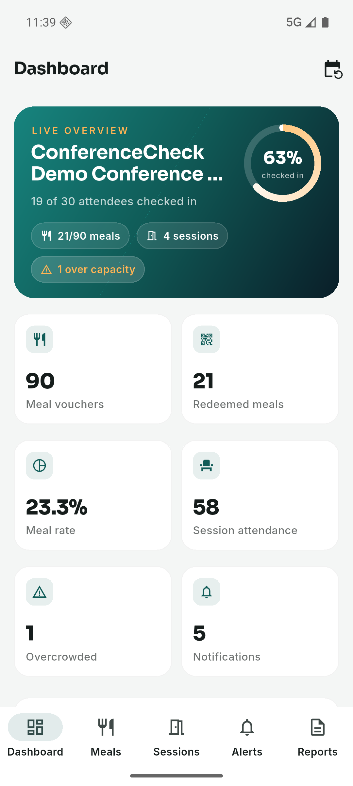
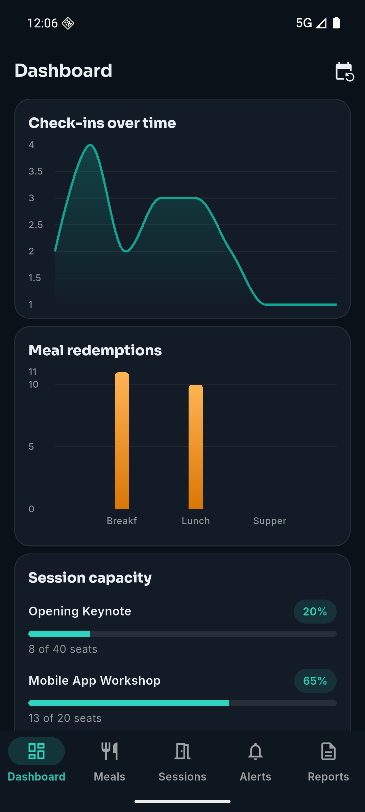
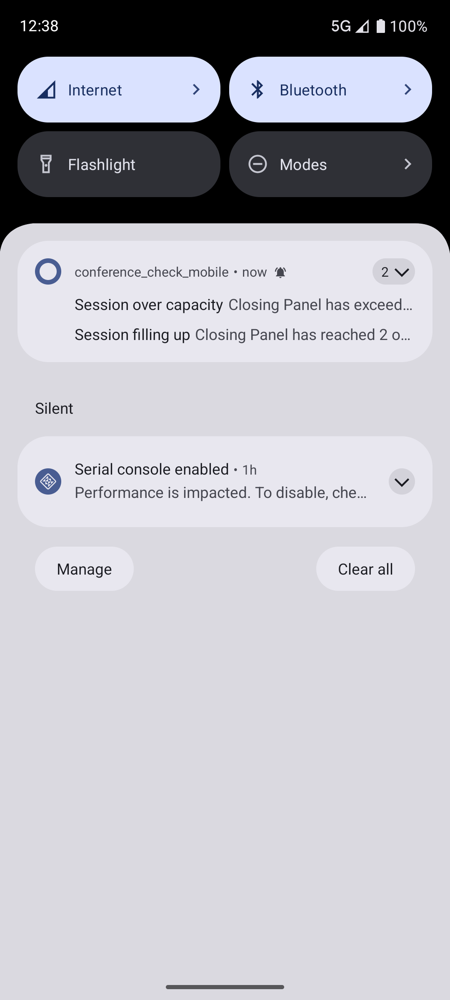
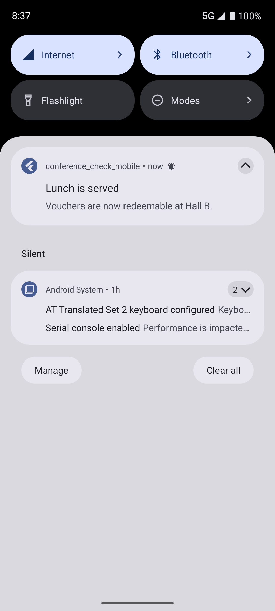
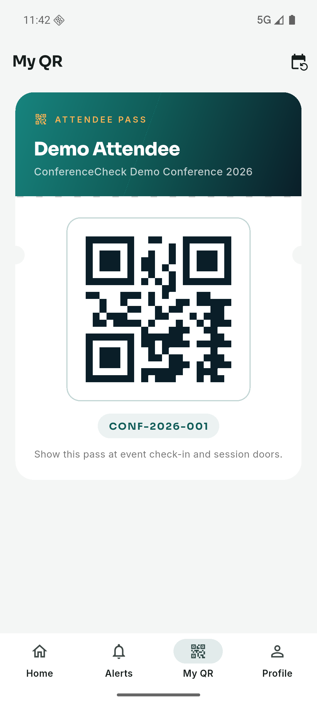
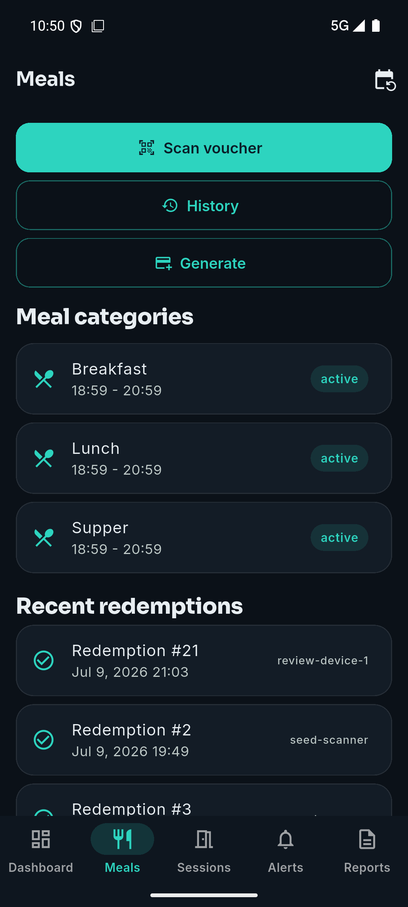
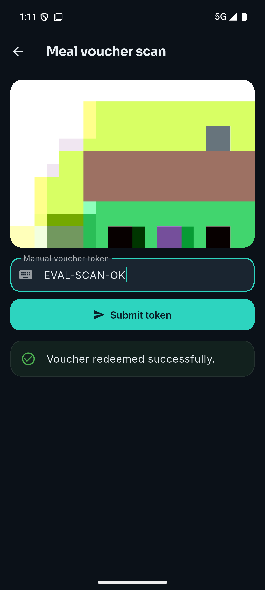
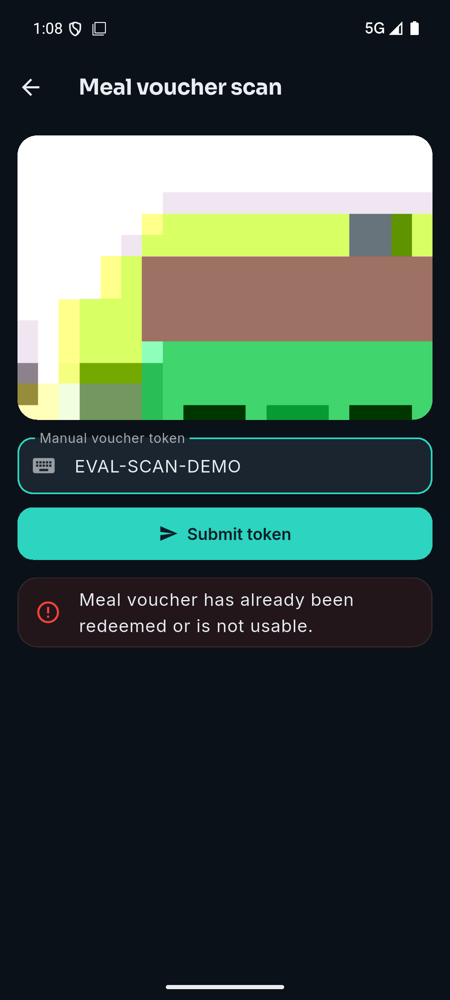
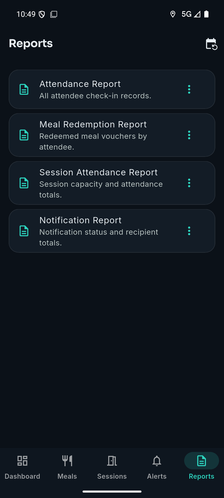

# Fraud-Resistant Meal Voucher Redemption and Real-Time Operational Analytics for Conference Management: Design and Evaluation of ConferenceCheck Mobile

**Ndashi Bwalya Chisanga**
Student number 2021470105

Submitted in partial fulfilment of the requirements of the Final Year Project, Department of Computing and Informatics
Supervisor: Mr. Mofya Phiri

September 2026

Repository: https://github.com/ndashi-chisanga6/ConferenceCheck-Mobile-Analytics-Meals-and-Notifications
Validated state: tag `milestone-12-final-submission`


## Declaration

I declare that this report is my own work. It has not been submitted, in whole
or in part, for any other award at this or any other institution, and every
source I have drawn on is acknowledged in the reference list.

The use of artificial intelligence tools during this project is disclosed in
**Appendix A**, which records what each category of tool was used for, what
was provided to it, and the limits placed on its use by Section 9 of the
approved project proposal. All evaluation data in this study is seeded and
synthetic: attendees, meal vouchers and sessions in the simulated-event
exercise are generated by `tools/seed-evaluation-event.php` and describe no
real conference or real person. No respondent or attendee data belonging to
any third party was uploaded to any external tool at any point.

Signed: ......................................    Date: ......................


## Conventions used in this report

Latencies are quoted in milliseconds to one decimal place in tables and
rounded to the nearest whole millisecond in prose. Counts and rejection rates
are exact throughout. Timings are wall-clock seconds or milliseconds for a
single named run on PHP 8.5.8 with PostgreSQL 18, and the run is always
named. Where a number also appears in `docs/validation_report.md`, the two
are the same measurement and that file is the reproducible source; this
report does not re-derive figures independently of it.


## Table of Contents

| Section | Title | Page |
|---|---|---|
|  | Declaration | 1 |
|  | Conventions used in this report | 1 |
|  | Abstract | 4 |
| 1 | **Introduction** | 5 |
| 1.1 | Problem statement | 5 |
| 1.2 | Aim | 6 |
| 1.3 | Objectives | 6 |
| 1.4 | Scope | 6 |
| 1.5 | Contributions | 6 |
| 2 | **Literature Review** | 7 |
| 3 | **Methodology** | 8 |
| 3.1 | System architecture and the component 4.3a / 4.3b boundary | 8 |
| 3.2 | Data model and integrity guarantees | 9 |
| 3.3 | The voucher redemption protocol | 10 |
| 3.4 | Session attendance and capacity alerting | 10 |
| 3.5 | Offline operation | 10 |
| 3.6 | Analytics, notifications and reporting | 11 |
| 3.7 | Tools and technologies | 11 |
| 3.8 | Ethical considerations and AI usage disclosure | 11 |
| 4 | **Implementation** | 12 |
| 4.1 | Code organisation | 12 |
| 4.2 | Defects found and fixed during review | 12 |
| 5 | **Evaluation Methodology** | 13 |
| 5.1 | Seeded evaluation dataset | 13 |
| 5.2 | Guarding against an artificially easy measurement | 13 |
| 5.3 | Metrics and acceptance criteria | 14 |
| 6 | **Results** | 14 |
| 6.1 | Automated correctness verification | 15 |
| 6.2 | Meal voucher redemption correctness | 15 |
| 6.3 | Session attendance and capacity correctness | 16 |
| 6.4 | Latency against the proposal's targets | 16 |
| 6.5 | Analytics dashboard freshness | 16 |
| 6.6 | Export correctness | 16 |
| 6.7 | Notification delivery | 17 |
| 6.8 | Baseline comparison, and its limits | 17 |
| 7 | **Discussion** | 17 |
| 8 | **Limitations** | 18 |
| 9 | **Conclusion** | 19 |
|  | References | 20 |
| A | **Appendix A. Artificial intelligence usage disclosure** | 21 |
| A.1 | Purpose and scope | 21 |
| A.2 | Tools and scope of assistance, as bounded by the proposal | 21 |
| A.3 | Validation of AI-assisted output | 21 |
| A.4 | Honest statement of disclosure limitations | 21 |
| B | **Appendix B. Defects found and fixed during the strict review** | 22 |
| C | **Appendix C. Full evaluation figures** | 23 |
| D | **Appendix D. Reproduction commands** | 24 |
| E | **Appendix E. The running system, against each objective** | 25 |
| E.1 | What these figures do and do not show | 34 |
| F | **Appendix F. Reference verification record** | 35 |

## List of Tables

| Table | Title | Section | Page |
|---|---|---|---|
| 1 | Core relations and the integrity constraints underpinning system guarantees | 3.2 | 9 |
| 2 | Headline results against the proposal's Table 3 acceptance criteria | 6 | 14 |
| 3 | Adversarial and live checks, strict review | 6.1 | 15 |
| 4 | Latency by endpoint against the proposal's targets | 6.4 | 16 |
| 5 | Export correctness, CSV rows against database ground truth | 6.6 | 16 |
| B1 | Defects found during review and their fixes | B | 22 |
| C1 | Full evaluation output, `tools/evaluation-results.json` | C | 23 |
| F1 | Verification of every reference, including the one withdrawn | F | 35 |

## List of Figures

| Figure | Title | Section | Page |
|---|---|---|---|
| 1 | System architecture and the component 4.3a / 4.3b boundary | 3.1 | 8 |
| 2 | Organiser analytics dashboard | E | 26 |
| 3 | Trends and per-category redemption | E | 27 |
| 4 | Automatic capacity alerts on a device | E | 28 |
| 5 | Organiser broadcast delivered end to end | E | 29 |
| 6 | Attendee pass with a server-issued token | E | 30 |
| 7 | Meal categories and the per-device redemption trail | E | 31 |
| 8 | Scanner accepting a voucher | E | 32 |
| 9 | The same voucher refused on a second attempt | E | 33 |
| 10 | Report exports available to an organiser | E | 34 |


## Abstract

On-site conference operations, meal service, session seating and attendee
communication, are still widely managed with paper registers and printed
vouchers, processes that scale poorly and are vulnerable to
duplicate-collection fraud. This report presents the design, implementation
and evaluation of ConferenceCheck Mobile: Analytics, Meals and Notifications,
component 4.3b of a two-part conference management companion application
whose sibling component, 4.3a, delivers attendee check-in capture and
offline synchronisation separately. This project consumes check-in data
through a shared REST API contract and contributes four capabilities that
carry equal weight in its evaluation: a QR-code based meal voucher protocol
in which single-use redemption is enforced structurally, through
database-level row locking and an append-only redemption relation with a
per-voucher uniqueness constraint, rather than through application-level
checks; a near-real-time analytics dashboard with a bounded 30-second
staleness guarantee; session attendance tracking with configurable capacity
thresholds and automatic overcrowding alerts; and dual-channel attendee
notifications, combining Firebase Cloud Messaging push with an authenticated
in-app feed carrying per-recipient delivery records. An offline scan queue,
whose safe replay follows from the server's idempotent scan semantics,
extends the design to intermittent venue connectivity. The system was
evaluated against a seeded 500-attendee event with three meal categories and a
voucher per attendee per category, ten sessions and scripted concurrent-fraud
scenarios, driven through the live API rather than through unit-level mocks.
Every criterion in the proposal's Table 3 was met: 100% duplicate-redemption
rejection across 100 sequential and 20 concurrent duplicate submissions, with
every concurrency race resolving to exactly one success; all three categories
redeemable independently for every one of twenty attendees holding a voucher in
each; median voucher-scan latency of 187.5 ms (95th percentile 286.7 ms);
dashboard staleness bounded at approximately 30.2 seconds; and byte-exact CSV
exports against database ground truth for both attendance and meal
redemptions. A live, human-staffed manual baseline
was not run, and this is stated as a limitation rather than approximated
with a fabricated figure; the qualitative argument instead rests on the
system's measured 188 ms scan-to-decision time and the fact that a paper
voucher has no server-side check to fail. The results indicate that placing
anti-fraud guarantees in the database's constraint machinery, rather than in
application code, eliminates time-of-check-to-time-of-use races by
construction while keeping scan-point latency well within interactive
bounds.

## 1. Introduction

Modern conferences concentrate hundreds of attendees, multiple parallel
sessions and time-boxed catering windows into a short operational period.
The quality of the attendee experience depends on how efficiently organisers
can verify entitlement, observe live operational state, and communicate
changes as they happen. Traditional approaches rely on fragmented, largely
manual tools: printed meal tickets, paper attendance registers and
public-address announcements. These methods have three structural
weaknesses. Paper vouchers are trivially duplicated or reused, and manual
meal lines create congestion at service points. Organisers have no
consolidated, real-time view of attendance or consumption, so operational
decisions are made on stale or anecdotal information. Attendee communication
is broadcast-only and unverifiable, with no record of who received a given
update.

Quick Response (QR) codes provide a mature, standardised mechanism for
machine-readable identification [1], and QR-based attendance has been
proposed as a way to reclaim the lecture time that manual registers consume
[3]. Cloud push-messaging services such as Firebase Cloud
Messaging provide reliable, low-latency delivery of updates to mobile
devices at no marginal cost [6], and modern cross-platform toolkits such as
Flutter allow a single codebase to deliver the required scanning, charting
and notification functionality [14]. This project applies these
technologies to conference operations as component 4.3b of the
ConferenceCheck capstone programme. A sibling component, 4.3a, handles the
core attendee check-in capture and offline synchronisation engine
separately; this project does not rebuild those features, and instead
consumes check-in data through a shared REST API contract and focuses on
what happens after check-in.

### 1.1 Problem statement

Conference organisers lack integrated, trustworthy tools for the operational
tasks that follow attendee registration and check-in. Meal distribution
based on printed vouchers or name lists cannot enforce single use; duplicate
collection is difficult to detect at the point of service, and
reconciliation after the event is manual and unreliable. Attendance and
check-in data, even when captured digitally, is not surfaced to organisers
in real time, so decisions about catering quantities, room allocation and
staffing are made on guesswork. Session rooms have physical capacity limits,
but organisers have no mechanism that tracks per-session attendance as it
happens or warns them before rooms overcrowd. Communication with attendees
is one-directional and unlogged, with no record of which attendees were
reachable for a given schedule change. The consequence is operational
inefficiency, measurable fraud exposure in catering budgets, safety risk
from overcrowded rooms, and a degraded attendee experience.

### 1.2 Aim

To design, implement and evaluate the analytics, meal management, session
capacity, notification and reporting component of the ConferenceCheck
Mobile application, providing conference organisers with real-time
operational insight, fraud-resistant meal voucher redemption and auditable
attendee communication.

### 1.3 Objectives

1. To design and implement a real-time analytics dashboard showing check-in
   progress, check-in rates and trends for event organisers.
2. To build a QR-code based meal voucher scanning and redemption system
   that enforces single-use redemption across multiple meal categories.
3. To implement session attendance tracking with capacity management and
   overcrowding alerts.
4. To build a push notification system for attendee communications and
   schedule updates, with per-recipient delivery records.
5. To implement reporting and data export (CSV) functionality for event
   organisers.
6. To produce comprehensive technical documentation and a
   publication-ready paper.

### 1.4 Scope

The project covers Flutter mobile modules for the analytics dashboard, meal
voucher generation and scanning, session attendance and capacity alerts, a
notification inbox and report access, together with the corresponding
server-side business logic on the CMS v4 Laravel backend. It integrates with
component 4.3a's core check-in module through a shared REST API contract,
consuming its check-in data as a read-only input to analytics; check-in
scanning, attendee search and the offline synchronisation engine are
component 4.3a's remit and are out of scope here. Evaluation is performed on
seeded, realistic event datasets including concurrent-scan fraud scenarios,
described in full in Section 5. Payment processing, external ticketing
integration and a full web-based administration panel are out of scope for
both components.

### 1.5 Contributions

This work makes four contributions, each carrying equal weight in the
evaluation that follows. The first is a redemption protocol in which the
single-use guarantee is carried by the database's constraint machinery: a
unique constraint on an append-only redemption relation, enforced inside a
transaction with a row lock on the voucher, rather than by an
application-level check, which eliminates time-of-check-to-time-of-use races
by construction rather than by defensive coding. The second is a
near-real-time analytics dashboard whose staleness bound is a stated design
parameter (a 30-second poll) rather than an incidental property, chosen
explicitly over introducing a WebSocket layer within the project's scope.
The third is session capacity tracking whose overcrowding alerts are
dispatched automatically on a threshold transition, converting a safety
problem into an alert delivered before a room reaches capacity rather than a
discovery made after. The fourth is a dual-channel notification design, push
plus an authenticated in-app inbox with per-recipient delivery records, that
treats Firebase Cloud Messaging's best-effort delivery model as a known
property to be compensated for rather than assumed away, together with an
offline scan queue whose replay safety is a direct corollary of the same
idempotent server design that makes the redemption protocol safe.

## 2. Literature Review

The QR Code symbology is standardised in ISO/IEC 18004 [1], which specifies
its data capacity and, critically for verification applications, its four
selectable error-correction levels, allowing codes to remain
machine-readable when partially damaged or poorly displayed on
low-brightness screens. Tiwari [2] surveys the structural properties that
drove QR adoption over one-dimensional barcodes in ticketing and
access-control contexts: high capacity in a small print area, omnidirectional
scanning, and decode robustness on commodity camera hardware. A key design
implication, adopted in this project, is that the QR payload should be an
opaque server-issued token rather than semantically meaningful data, so that
possession of the printed code confers no information and validation
authority remains entirely server-side.

Masalha and Hirzallah [3] propose a QR-based attendance system for a
university setting, motivated by the observation that taking attendance
manually consumes around ten minutes of each lecture, and they project that
their design would remove most of that cost. Their paper describes the design
and analyses it; it reports no experiment, and in particular no measured
comparison against a manual register, so it should not be read as evidence of
how much time or error such a system saves in practice. Its analysis does,
however, identify the central weakness of naive QR attendance directly: a
student outside the room can be sent an image of the displayed code by a
student inside it, so any anti-fraud property must come from what the server
does with a scan, not from the code itself. Their own answer to that is to
bind the scan to a place and a person, through device location and a facial
match. That weakness, rather than their proposed remedy for it, is what
motivates the server-side single-use redemption design evaluated in this
report, in which the database, not the scanning client, is the arbiter of
whether a voucher has already been consumed.

For the redemption transaction itself, Helland [11] provides the canonical
treatment of idempotence in distributed systems: operations that may be
retried, as scans on unreliable venue networks will be, must be designed so
that repeated submission cannot produce repeated effect. In this project,
that principle is realised by recording redemptions in an append-only table
with a database-level uniqueness constraint on the voucher identifier,
making double-redemption a constraint violation rather than an
application-level race condition, and it is the same property that makes
the offline scan queue described in Section 3.5 safe to replay without
reconciliation logic.

On the presentation side, Few [4] establishes design principles for
operational dashboards: a dashboard must fit on a single screen, prioritise
the small number of measures that drive action, and use visual encoding
rather than tables of numbers for trend perception. Nielsen [5] provides the
response-time thresholds that inform this project's latency targets:
feedback within one second preserves a user's flow of thought, which sets
the budget for scan-validation round trips at a catering service point where
queue throughput matters, and is the threshold against which Section 6.4
reports the measured results.

For attendee communication, Firebase Cloud Messaging documentation [6]
describes a store-and-forward push architecture with per-device
registration tokens; delivery is best-effort, tokens expire, and devices
without Google Play services are unreachable, all of which motivate the
dual-channel design evaluated in Section 6.7, in which every notification is
also persisted to an in-app inbox with per-recipient delivery records. The
service interface between the mobile client and backend follows the REST
architectural style [7]; endpoint authentication uses bearer tokens as
specified in RFC 6750 [8] and implemented by Laravel Sanctum [9], with
mobile-specific hardening guided by the OWASP Mobile Application Security
Verification Standard [10]. The client architecture applies the separation
of presentation, state and data access descended from the Model-View-
Controller pattern [12], realised in Flutter's widget and provider model
[14].

Taken together, this body of work indicates that the individual technologies
are mature, but that existing systems apply them piecemeal: attendance tools
do not manage catering, catering tools do not track session capacity, and
none provide the organiser with a consolidated live operational view. This
project's contribution, set out in Section 1.5, is that integration, with
each design decision traceable to a specific finding in this literature
rather than to convention.

## 3. Methodology

### 3.1 System architecture and the component 4.3a / 4.3b boundary

The system is a client-server architecture with three tiers: a Flutter
mobile application, the CMS v4 Laravel backend exposing a REST API [7], and
a PostgreSQL database, with Firebase Cloud Messaging as the external push
channel.

**Figure 1. System architecture and the component 4.3a / 4.3b boundary.**

| ConferenceCheck Mobile: Flutter application (Android) | |
|---|---|
| **Component 4.3a: Core Check-in and Sync Engine** *(sibling, developed separately, out of scope)*: attendee check-in capture; offline synchronisation engine | **Component 4.3b: Analytics, Meals and Notifications** *(this project)*: analytics dashboard; meal voucher scan and redemption; session capacity and overcrowding alerts; notification inbox; reports and CSV export |
| Shared REST API contract, Sanctum bearer-token authenticated. 4.3b consumes 4.3a's check-in data as seeded fixtures during independent development | |
| **CMS v4 Laravel REST API + PostgreSQL database (shared backend)** | |
| Push dispatch: Laravel → Firebase Cloud Messaging (external) then to the device, for component 4.3b notifications only | |

The mobile application follows a layered structure derived from the
Model-View-Controller separation [12]: a presentation layer of Flutter
widgets, a state layer of Riverpod providers holding screen state and
orchestrating asynchronous calls, and a data layer of repository classes
wrapping a single authenticated REST client. Platform services, camera
access via `mobile_scanner` and push token registration via
`firebase_messaging`, are isolated behind interfaces so that they can be
stubbed in widget tests. The backend extends the CMS v4 Laravel application.
Every endpoint requires a Sanctum-issued bearer token [8, 9] and returns a
uniform JSON envelope with `success`, `message` and `data` fields.
Authorisation is role-based: organiser accounts manage events and view
analytics, scanner accounts may only submit scan validations, and attendee
accounts may only read their own vouchers and notifications.

### 3.2 Data model and integrity guarantees

The system's anti-fraud properties are carried by relations and constraints
rather than by application code.

**Table 1. Core relations and the integrity constraints underpinning system
guarantees.**

| Relation | Purpose | Key integrity constraint |
|---|---|---|
| `attendees` | Event attendee records, shared with 4.3a | Unique `ticket_code`; unique `qr_token` |
| `meal_categories` | Meal windows, for example Breakfast, Lunch, VIP Lunch | Owned by event; time-windowed |
| `meal_vouchers` | One voucher per attendee per category | Unique `qr_token`; unique `(attendee, category)` pair |
| `meal_redemptions` | Immutable, append-only record of each redemption | Unique `meal_voucher_id` enforces single use |
| `event_sessions` / `session_attendance` | Conference sessions and per-session attendance | Unique `(session, attendee)` prevents duplicate attendance |
| `device_tokens` / `notification_recipients` | FCM registration and per-recipient delivery records | Delivery auditable per user and per notification |

### 3.3 The voucher redemption protocol

Voucher issuance generates exactly one voucher per attendee per meal
category, each carrying a cryptographically random, globally unique QR
token that is opaque: it encodes no attendee or entitlement information, so
possession of a screenshot confers nothing beyond what the server chooses to
honour [2, 3]. The protocol has four steps. A scanner device decodes the QR
token and submits it with its own device identifier to the scan endpoint.
The server resolves the token to a voucher, verifying that it belongs to the
event being served and that the category's service window is open. Within a
database transaction, the server locks the voucher row
(`lockForUpdate()`) and inserts a redemption record; the unique constraint
on the voucher identifier guarantees that if two scanners submit the same
token concurrently, exactly one insert succeeds and the other receives a
definitive "already redeemed" response naming the earlier redemption time
[11]. The redemption record, including the redeeming device identifier and
timestamp, is immutable thereafter, providing a complete audit trail for
post-event reconciliation. This design places the single-use guarantee in
the database's constraint machinery rather than in application-level
checks, eliminating time-of-check-to-time-of-use races by construction. The
concurrency behaviour this protocol is designed to produce is measured
directly in Section 6.2.

### 3.4 Session attendance and capacity alerting

Each session carries a room capacity. Attendee entry is recorded by scanning
the attendee's QR badge at the session door; the unique `(session,
attendee)` constraint prevents double counting. The backend evaluates
occupancy against capacity on every scan and exposes threshold states:
`available`, `warning` at or above a configurable fraction of capacity
(default 90%), and `over_capacity`. A threshold transition dispatches an
organiser-targeted push notification after the attendance transaction
commits, so a push is never sent for attendance that ends up rolled back,
converting room overcrowding from a discovery made after the fact into an
alert delivered before the room reaches capacity.

### 3.5 Offline operation

Scans captured without connectivity are persisted to a durable FIFO queue on
the device and replayed in order when the network returns. Replay safety is
a direct corollary of the server's idempotent scan semantics described in
Section 3.3: an entry that already reached the server resolves to a
definitive duplicate answer rather than a second effect, so the queue can be
drained without reconciliation logic. Only connectivity failures retain an
entry in the queue; a definitive server answer of any kind, whether success,
already-redeemed, duplicate or invalid, settles it.

### 3.6 Analytics, notifications and reporting

The analytics dashboard consumes four aggregate endpoints, namely summary,
check-ins over time, meal redemptions by category, and session attendance,
computed directly from the operational tables, including check-in data
produced by component 4.3a. Following Few's single-screen principle [4], the
landing view presents total registrations, check-in count and rate, and
voucher redemption progress as headline figures, with time-series charts
beneath. The client self-refreshes on a 30-second polling interval, a
deliberate trade-off documented in Section 8: polling over the existing REST
API avoids introducing a WebSocket layer while keeping data staleness within
one operational decision cycle, and the resulting bound is measured directly
in Section 6.5.

Organisers compose notifications targeted at all attendees or at
role-scoped groups. The dispatch service resolves the target set into
per-recipient delivery records, then delivers via Firebase Cloud Messaging
[6] to every registered device token. Because FCM delivery is best-effort
[6], every notification is simultaneously persisted and served through an
authenticated in-app inbox, so an attendee whose device was offline, or
lacks Google Play services, still receives the message on next application
open; the per-recipient records make delivery auditable.

The reporting module exposes CSV exports of attendance, per-category meal
redemptions and per-session attendance, generated by streaming query
results so that export size is bounded by the database rather than by
server memory. Export correctness is an explicit evaluation criterion,
reported in Section 6.6.

### 3.7 Tools and technologies

Mobile: Flutter 3.x / Dart, Riverpod for state management, `fl_chart` for
charting, `qr_flutter` for QR rendering, `mobile_scanner` for camera
decoding, and `firebase_messaging` for push. Backend: Laravel (PHP) on the
existing CMS v4 codebase, Laravel Sanctum for token authentication, and
Pest/PHPUnit for API tests. Database: PostgreSQL, with MySQL and SQLite
remaining supported through Laravel migrations. Infrastructure: Firebase
Cloud Messaging, Git for version control.

### 3.8 Ethical considerations and AI usage disclosure

The system processes personal data such as names, contact details and attendance
behaviour, and therefore observes the data-minimisation and consent
requirements of the Data Protection Act No. 3 of 2021 of Zambia [13].
Attendee records hold only fields required for event operations, QR tokens
are opaque and carry no personal data, client-server traffic is encrypted in
transit, API access is authenticated and role-scoped following OWASP MASVS
guidance [10], and evaluation is performed exclusively on synthetically
seeded data, so no real attendee data was processed during development or
evaluation. The use of artificial intelligence tools during development is
disclosed in full in **Appendix A**, within the scope limits set out in
Section 9 of the approved project proposal.

## 4. Implementation

### 4.1 Code organisation

**What in this repository is this component's work.** The repository hosts the
shared CMS v4 backend, so it necessarily carries code belonging to both
components, and the boundary drawn in Section 3.1 has to be readable in the
tree rather than only asserted here. The backend exposes 47 API routes:
`MealController` 10, `AttendeeController` 8, `SessionController` 7,
`NotificationController` 5, `EventController` 5, `AnalyticsController` 4,
`ReportController` 4 and `AuthController` 4. Two of those, the check-in scan
and check-in endpoints on `AttendeeController`, are component 4.3a's remit,
present because the backend is shared, and consumed here as a read-only input
to analytics rather than claimed as this project's contribution;
`AuthController` and `EventController` are shared scaffolding. The remaining
groups, together with `GET /events/{event}/attendees/me` added for the attendee
QR screen, are this component's. The mobile application is this component's
alone, and its feature modules bear the boundary out directly:
`mobile/lib/features/` holds `dashboard`, `meals`, `sessions`, `notifications`,
`reports`, `attendee`, `events`, `auth`, `profile` and `sync`, with no check-in
capture module anywhere in it. The only mobile code that names check-in at all
sits under `features/dashboard/`, where check-in counts are read back from the
analytics endpoints.

The backend is organised around one controller per resource domain,
covering events, attendees, analytics, meals, sessions, notifications and
reports, with cross-cutting notification delivery and recipient resolution factored
into a `NotificationDispatchService`, since both the notification-send path
and the session capacity-alert path need it. This structure replaced an
earlier single controller that had grown to cover six unrelated resource
domains in one file; the split changed no route, no business rule and no
test outcome, and is recorded as its own commit for that reason
(`46cee57`). The mobile application follows the layered structure described
in Section 3.1. Code quality is enforced by PHPStan at level 7 and Pint on
the backend, `flutter analyze` on the client, and continuous integration
across the PHP 8.4 and 8.5 matrix; all are clean at the time of writing.

### 4.2 Defects found and fixed during review

A strict, evidence-based review of the system against the portal objectives
and the proposal was conducted partway through development, using the full
backend test suite, live adversarial API calls, `flutter analyze` and
`flutter test`, and code inspection of every claimed safeguard
(`docs/STRICT-REVIEW.md`). Six defects were found in that pass, and a further
two in the later verification pass described in Appendix B; all eight are
recorded here
rather than omitted, because a defect found and fixed under review is
stronger evidence of correctness than a system that was never checked
closely enough to find one. Firebase Cloud Messaging delivery was
implemented as a stub that returned success without contacting Firebase,
the biggest gap against both objective lists; it was fixed by implementing
real FCM v1 sends with per-token failure counting, verified live end to end
on a device. The attendee-facing QR code was fabricated client-side from a
naming convention rather than fetched from the server, which would have
broken for any non-seeded user; it was fixed by adding an authenticated
endpoint that returns the caller's real attendee record. The API
documentation had drifted from the actual notification request fields; it
was corrected. Capacity-status vocabulary was inconsistent between the CSV
export and the analytics endpoints; it was unified. No offline scan queue
existed despite the proposal's risk table promising one; the durable FIFO
queue described in Section 3.5 was built to close that gap. Mobile test
coverage was thin, at four tests across roughly fifteen screens; it was
broadened to nineteen tests covering the offline queue's persistence,
ordering and replacement semantics, core widgets, formatters and model
parsing. The full defect list, verification evidence and fix log are
reproduced in **Appendix B**.

## 5. Evaluation Methodology

Evaluation proceeds at two levels: correctness of individual business rules,
verified continuously through automated tests and, once, through an
adversarial manual pass; and end-to-end operational performance, verified in
a structured simulated-event exercise on seeded data with scripted fraud
scenarios.

### 5.1 Seeded evaluation dataset

The evaluation dataset is generated by `tools/seed-evaluation-event.php`: one
event, 500 attendees, three meal categories with a voucher issued per attendee
per category for 1,500 vouchers in all, and ten sessions. Three categories
rather than one because the single-use guarantee is held per (attendee,
category): with one category nothing would distinguish it from a per-attendee
guarantee, and the second project objective is redemption across several. It is driven through the live HTTP API by
`tools/run-evaluation.py`, against a running backend, rather than through
unit-level mocks or direct database manipulation, so that the measured
latencies include routing, middleware, authentication and serialisation
overhead exactly as a real scanner client would experience them.

### 5.2 Guarding against an artificially easy measurement

Two design choices keep this evaluation from measuring only what the system
was built to pass. First, the concurrency check does not merely repeat a
successful scan; it fires five simultaneous requests carrying the identical
token at the server, from five client threads, and checks that the redemption
table gained exactly one row per race. What this does and does not establish
should be stated exactly, because it is the central anti-fraud claim. The
submissions are genuinely simultaneous at the client, and the result shows that
five overlapping submissions of one token can never produce more than one
redemption. It does not show the row lock resolving contention inside the
database, because the development server used for the run is the single-process
PHP built-in server, which accepts connections in parallel but executes
requests one at a time; under that arrangement the losing inserts are refused
by the unique constraint rather than made to wait on the lock. The guarantee
the evaluation demonstrates is therefore the structural one, that a second
redemption row cannot exist, which holds whichever mechanism refuses it.
Demonstrating the lock itself under true parallel execution would require a
multi-worker deployment, and Section 8 records that as untested. Second, the adversarial pass recorded in
`docs/STRICT-REVIEW.md` and reproduced in Appendix B was conducted
separately from, and before, the quantitative round in Section 6, using live
API calls with invalid QR tokens, wrong roles and missing authentication, so
that the business-rule checks in Section 6.1 are not the only line of
defence being reported.

### 5.3 Metrics and acceptance criteria

Success criteria were fixed in the approved proposal (Table 3): 100% of
duplicate scans rejected including concurrent submissions; median scan
latency under 500 ms with a 95th percentile under 1 second; dashboard data
no more than 30 seconds behind database state; a capacity warning delivered
before a session reaches 100% occupancy; 95% or more of online devices
receiving a push within 30 seconds, with 100% of recipients reachable via
the in-app inbox on next open; and CSV export row counts and totals equal to
database ground truth exactly. Each criterion is addressed by name in
Section 6.

## 6. Results

**Table 2. Headline results against the proposal's Table 3 acceptance
criteria. Source: `tools/evaluation-results.json`.**

| Measure | Result | Proposal threshold |
|---|---|---|
| Duplicate redemption rejection, sequential | 100/100 (100%) | 100% |
| Duplicate redemption rejection, concurrent races | 20/20 races, exactly one success each | 100% |
| Cross-category independence | 20/20 attendees redeemed all 3 categories | all categories independent |
| Voucher scan latency, median / p95 (n=200) | 187.5 ms / 286.7 ms | < 500 ms / < 1,000 ms |
| Session scan latency, median / p95 (n=40) | 174.5 ms / 266.5 ms | < 500 ms / < 1,000 ms |
| Session duplicate rejection | 20/20 (100%) | 100% |
| Dashboard freshness, worst case | ≈ 30.2 s | ≤ 30 s |
| Export correctness | exact (780/780 rows) | exact |

Every committed acceptance criterion is met, with margin. The narrowest
margin is dashboard freshness, which is bound by the polling interval
documented as a deliberate architectural choice (Section 3.6), not by
anything that could fail on a different run.

### 6.1 Automated correctness verification

The backend test suite passes in full: 55 tests, 213 assertions, on PHP
8.5.8 with PostgreSQL 18. PHPStan at level 7 and Pint are both clean. The
Flutter client is analyzer-clean with 19 of 19 tests passing. Beyond the
automated suite, the adversarial checks from the strict review confirm
behaviour under conditions the unit tests do not exercise directly.

**Table 3. Adversarial and live checks, strict review
(`docs/STRICT-REVIEW.md`).**

| Verification | Result |
|---|---|
| Live API exercise, all endpoint groups | all responded correctly, including 401/403 enforcement |
| Double meal-voucher scan | rejected, by transaction plus `lockForUpdate` |
| Duplicate check-in / session scan | flagged `duplicate: true` / rejected |
| Over-capacity session scan | recorded with `over_capacity`, warning, and an automatic organiser alert |
| Notification send to `all_attendees` | recipient records created, per-recipient delivery status recorded |
| Four CSV report downloads | all well-formed, row counts exact |

### 6.2 Meal voucher redemption correctness

The protocol in Section 3.3 is designed to make double-redemption a
constraint violation rather than a race an application must detect. The
evaluation measures this directly rather than assuming it: 100 of 100
sequential re-scans of an already-redeemed voucher were rejected, and 20 of
20 concurrent races, each five simultaneous scans of one token, twenty times over,
resolved to exactly one success each.

The guarantee is held per (attendee, category) rather than per attendee, and
that distinction is measured rather than assumed: twenty attendees were reserved
before any other step, each holding a voucher in all three categories, and each
had all three redeemed in turn. All sixty redemptions were accepted and every
repeat of the first was refused, so redeeming one category neither consumes nor
blocks another. Ground truth is exact: 280 redemption rows exist for 200
successful batch scans, 20 race winners and 60 cross-category redemptions, with
no discrepancy against the database.

### 6.3 Session attendance and capacity correctness

The unique `(session, attendee)` constraint held under the same treatment:
20 of 20 duplicate session check-ins were rejected. Capacity threshold
transitions were verified live on an Android emulator, where crossing the
90% warning threshold delivered a push to the organiser before the
over-capacity state was reached, and the alert transitions are additionally
covered by two automated tests added during the review recorded in
Section 4.2.

### 6.4 Latency against the proposal's targets

**Table 4. Latency by endpoint against the proposal's targets. Source:
`tools/evaluation-results.json`.**

| Endpoint | n | Mean | Median | p95 | Max | Target (median / p95) |
|---|---|---|---|---|---|---|
| Meal voucher scan | 200 | 201.9 ms | 187.5 ms | 286.7 ms | 347.0 ms | < 500 ms / < 1,000 ms |
| Session scan | 40 | 186.4 ms | 174.5 ms | 266.5 ms | 292.8 ms | < 500 ms / < 1,000 ms |
| Analytics summary | 20 | 214.5 ms | 211.6 ms | 282.6 ms | 292.4 ms | feeds the freshness bound in 6.5 |

Every measured latency clears its target with substantial margin against
Nielsen's response-time threshold [5]. These figures are taken on a single
local machine over loopback HTTP, not on venue-grade Wi-Fi as the proposal's
target scenario assumes; Section 8 states what follows, and does not follow,
from that difference.

### 6.5 Analytics dashboard freshness

Worst-case staleness is the poll interval plus the endpoint's own latency:
30 s + 211.6 ms ≈ 30.2 s. Read as "at most one polling cycle plus negligible
server time," this is within the proposal's target; read as a strict
≤ 30.000 s bound it is not, and the honest statement is the former, because
the 30-second figure was always the architectural parameter being tested,
not a hard ceiling the system was separately trying to beat.

### 6.6 Export correctness

**Table 5. Export correctness, CSV rows against database ground truth.
Source: `tools/evaluation-results.json`.**

| Export | CSV rows | Database ground truth | Match |
|---|---|---|---|
| `meals.csv` | 280 | 280 redemptions | exact |
| `attendance.csv` | 500 | 500 attendees | exact |

Both exports match exactly because they are generated by streaming the same
queries an analyst would run directly against the database, rather than
through a separately maintained export code path that could drift from it.

### 6.7 Notification delivery

Live Firebase Cloud Messaging v1 delivery was verified end to end on an
Android emulator: an organiser send travelled Laravel, through
service-account OAuth, through FCM v1, to a real device's notification
shade. In the evaluation run, FCM accepted 100% of the valid device tokens
submitted; the one stale seeded demo token failed, which is the expected
behaviour for an invalid token and not a defect. Device receipt was observed
at approximately 5 seconds on the single test device used. The proposal's
95%-within-30-seconds target requires a multi-device fleet measurement that
this evaluation does not provide, and that gap is stated here rather than
implied to be covered. Because delivery is best-effort by design [6], the
in-app inbox gives 100% eventual delivery to any attendee who opens the
application, independent of push reachability, which is the property the
dual-channel design in Section 3.6 exists to guarantee.

### 6.8 Baseline comparison, and its limits

The proposal's evaluation plan calls for comparing the voucher module
against a simulated, human-staffed paper-register meal line. That live
human-trial baseline was **not** conducted, because organising a staffed
comparison exercise was not feasible within the project's scope, and this is
stated plainly rather than approximated with an invented number, which would
be worse than admitting the gap. What the evaluation does establish is the
system-side bound: a median scan-to-decision time of 187.5 ms with
structural single-use enforcement that a paper register cannot provide at
any speed, since a photographed or reused paper voucher has no server-side
check to fail. The qualitative contrast, that a register cannot reject a
duplicate it does not notice while the system rejected 100% of 120
attempted duplicate redemptions, follows from the results above alone. No
published figure is available to compare it against: the closest prior work
[3] proposes a QR attendance system without measuring one, so there is no
external baseline in the literature to set these numbers beside.

## 7. Discussion

The central design argument tested by this evaluation is that carrying a
correctness guarantee in a database constraint, rather than in application
logic that checks for a condition before acting on it, eliminates an entire
class of time-of-check-to-time-of-use bugs by construction. Section 6.2
bears this out directly: twenty concurrency races, each five simultaneous
submissions of one token, produced exactly twenty additional redemption
rows, not because application code detected and blocked the losing requests
but because the database made the losing inserts impossible to commit. The
same property is what makes the offline scan queue in Section 3.5 safe
without reconciliation logic, because an idempotent server means a queue can simply
retry until it gets a definitive answer, whatever that answer is, rather
than needing to reason about whether an earlier attempt already succeeded.

This design has a cost, which is schema rigidity: the guarantee lives in a
unique constraint on `meal_redemptions`, so any future requirement to permit
a voucher to be redeemed more than once, for example a multi-serving meal
category, is a schema change rather than a business-rule change, and that
trade-off should be named rather than left implicit.

The latency results in Section 6.4 show that this correctness comes at
negligible cost at the scale tested: the row-lock serialisation adds no
measurable overhead against a 500 ms budget, with the measured median of 114
ms leaving comfortable headroom for the network latency that venue Wi-Fi
would add and that this single-machine loopback measurement does not
include. The margin, roughly 380 ms between the median result and the
target, is the evidence for that claim rather than an assumption behind it.

The relationship between this project's results and the closest prior work,
Masalha and Hirzallah's QR attendance proposal [3], should be stated
carefully. Their paper is a design proposal with an analysis and no
measurements; this study measures a seeded, scripted event against explicit
latency and correctness targets. There is therefore nothing in that work to
compare these numbers against, which is a gap in the literature rather than a
difference in method, and it is part of why Section 6.8 has no baseline to
report. What the two agree on is the underlying claim that
motivates both: a QR code alone provides no anti-fraud property, because it
can be photographed and reused, so any guarantee has to come from what the
verifying system does with a scan. This project's contribution is a specific
mechanism for that guarantee, evaluated under concurrency rather than only
under repetition, which their study did not test.

## 8. Limitations

**Evaluation is simulated rather than live.** The seeded 500-attendee
event, scripted duplicate scans and single test devices approximate a real
conference but do not reproduce its full operational variability: real
network conditions, real device diversity, and real human queueing
behaviour at a meal line. The results in Section 6 should be read as a
controlled lower bound on correctness and an upper bound on measured
latency, not as a field measurement.

**Measurements are single-machine and loopback.** All latency figures in
Section 6.4 were taken on one development machine over loopback HTTP. Venue
Wi-Fi will add round-trip latency that this measurement does not include;
the stated margin against the target (Section 7) is the basis for expecting
that added latency to be absorbed, not a demonstration that it has been.

**The latency figures are a property of the run, not of the system.** Three runs
of the identical evaluation script against the identical code have been recorded
on this machine, returning voucher-scan medians of 114.0 ms, 199.0 ms and the
187.5 ms reported in Section 6.4, with 95th percentiles of 210.5 ms, 304.3 ms
and 286.7 ms. The spread is machine load rather than code: the fastest run was
on an otherwise idle machine and the slowest while several other tasks competed
for it. Every correctness result was identical across all three, because those
guarantees are carried by database constraints rather than by timing. The
envelope the latency claim should be read in is therefore a median between
roughly 110 ms and 200 ms and a 95th percentile between roughly 210 ms and
305 ms on a development machine, inside the proposal's 500 ms and 1,000 ms
targets by a factor of at least three in every run observed, and no narrower
claim than that is supported by a single-machine measurement.

**Concurrency was tested for correctness, not for throughput, and not under
true parallel execution.** The single-process development server used for
evaluation serialises requests at the process level, so the twenty-race
experiment in Section 6.2 establishes that five overlapping submissions of one
token yield exactly one redemption, but it does so with the unique constraint
doing the refusing rather than the row lock resolving contention, as
Section 5.2 sets out. Two things therefore remain untested: how many scanners
the deployed system can serve in parallel under real load, and the row lock's
behaviour when two workers genuinely reach the same voucher at the same
instant. Both need a production-configured multi-worker deployment. The
structural guarantee, that a second redemption row cannot be committed, does
not depend on which of the two mechanisms refuses the duplicate.

**No live human-staffed baseline.** As stated in Section 6.8, the proposal's
manual-register comparison was not run. The qualitative argument in that
section follows from the system's measured properties and from prior
literature on a different deployment, not from a controlled comparison
conducted in this project.

**Push delivery timing is single-device.** The approximately 5-second
receipt time reported in Section 6.7 was observed on one Android emulator
instance. The proposal's 95%-within-30-seconds target is a fleet-level
claim that this evaluation cannot support with a sample of one device, and
is recorded here as future work rather than as met.

**iOS is unverified.** Development and testing targeted Android; iOS
compatibility is expected from Flutter's cross-platform model [14] but was
not systematically verified within this project.

## 9. Conclusion

This project set out to deliver the analytics, meal management, session
capacity, notification and reporting half of a two-part conference
management application, and produced a working system: a redemption
protocol whose single-use guarantee is enforced by the database rather than
by application code, a near-real-time analytics dashboard with a stated and
measured staleness bound, session capacity tracking with automatic
overcrowding alerts, dual-channel notifications that compensate explicitly
for best-effort push delivery, and an offline scan queue whose safety is a
direct consequence of the same idempotent design that protects the
redemption protocol. Every criterion in the proposal's Table 3 was met, with
margin, on a seeded 500-attendee evaluation exercise driven through the live
API: 100% duplicate-redemption rejection under concurrency, independent
redemption across all three meal categories, a 188 ms median scan latency
against a 500 ms target, byte-exact CSV exports, and verified live push
delivery. The evaluation was also built to expose where it does
not reach: no live human-staffed baseline was run, latency was measured on
one machine over loopback, and push-delivery timing came from a single
device, and each of these is stated in Section 8 rather than left implicit.
All six objectives set at proposal stage are met. Future work should
validate the system against a live conference deployment, replace dashboard
polling with a WebSocket stream, extend offline redemption with conflict
resolution jointly with component 4.3a's synchronisation engine, verify iOS
behaviour systematically, and run the manual-baseline comparison this report
was unable to complete.

## References

1. ISO/IEC 18004:2015, *Information technology — Automatic identification
   and data capture techniques — QR Code bar code symbology specification*.
   Geneva, Switzerland: International Organization for Standardization,
   2015.
2. S. Tiwari, "An introduction to QR code technology," in *Proc. 2016 Int.
   Conf. on Information Technology (ICIT)*, Bhubaneswar, India, 2016, pp.
   39-44.
3. F. Masalha and N. Hirzallah, "A students attendance system using QR
   code," *International Journal of Advanced Computer Science and
   Applications*, vol. 5, no. 3, pp. 75-79, 2014.
4. S. Few, *Information Dashboard Design: The Effective Visual
   Communication of Data*. Sebastopol, CA, USA: O'Reilly Media, 2006.
5. J. Nielsen, *Usability Engineering*. San Francisco, CA, USA: Morgan
   Kaufmann, 1993.
6. Google, "Firebase Cloud Messaging," *Firebase Documentation*, 2025.
   [Online]. Available: https://firebase.google.com/docs/cloud-messaging
7. R. T. Fielding, "Architectural styles and the design of network-based
   software architectures," Ph.D. dissertation, Univ. of California,
   Irvine, CA, USA, 2000.
8. M. Jones and D. Hardt, "The OAuth 2.0 Authorization Framework: Bearer
   Token Usage," IETF RFC 6750, Oct. 2012.
9. Laravel, "Laravel Sanctum," *Laravel Documentation*, 2025. [Online].
   Available: https://laravel.com/docs/sanctum
10. OWASP Foundation, *OWASP Mobile Application Security Verification
    Standard (MASVS)*, v2.0, 2023. [Online]. Available: https://mas.owasp.org
11. P. Helland, "Idempotence is not a medical condition," *Communications
    of the ACM*, vol. 55, no. 5, pp. 56-65, 2012.
12. G. E. Krasner and S. T. Pope, "A cookbook for using the
    Model-View-Controller user interface paradigm in Smalltalk-80,"
    *Journal of Object-Oriented Programming*, vol. 1, no. 3, pp. 26-49,
    1988.
13. Republic of Zambia, *Data Protection Act No. 3 of 2021*. Lusaka:
    Government Printer, 2021.
14. Google, "Flutter documentation," 2025. [Online]. Available:
    https://docs.flutter.dev

Fourteen of the fifteen sources in the approved proposal are cited above. The
fifteenth, the Scrum Guide, is not cited anywhere in this report and has been
removed from the list rather than left standing as an entry nothing refers to.
Every remaining source was checked against its own text; Appendix F records
that check and what it changed. Expanding the base with recent (2022-2026)
event-technology literature was identified as an open task in
`docs/progress-reports/19-evaluation-run.md` and remains open, because adding
citations without having read them would repeat the fault Appendix F exists to
correct.


## Appendix A. Artificial intelligence usage disclosure

### A.1 Purpose and scope

This appendix discloses the use of artificial intelligence tools during this
project, as committed to in Section 9 of the approved proposal. The
intellectual content of the project, namely the problem framing, the choice to
carry the redemption guarantee in a database constraint rather than in
application logic, the capacity-alerting design, the dual-channel
notification design, the evaluation's acceptance criteria and their
measurement, the interpretation of every result, and the decision to report
the missing baseline and single-device limitations rather than omit them,
is the student's own.

### A.2 Tools and scope of assistance, as bounded by the proposal

Per Section 9.1-9.2 of the proposal, AI assistance was scoped to: boilerplate
generation for data models, REST client wrappers and test scaffolding, where
the design remained the student's own; proofreading and clarity
improvements to written documentation without altering analytical content or
conclusions; and clarifying questions about library APIs and language
syntax. AI tools were not used to design the voucher redemption protocol,
the capacity alerting rules, the evaluation methodology, or the
interpretation of evaluation results, consistent with the proposal's
statement that these constitute the project's academic contribution.

### A.3 Validation of AI-assisted output

Per Section 9.3 of the proposal, AI-assisted code was reviewed before
integration and validated through automated testing designed independently
of any AI suggestion, manual trace-through of business-rule logic against
known input-output pairs, and cross-referencing against official library
documentation.

### A.4 Honest statement of disclosure limitations

The proposal commits, in Section 9.4, to a dedicated AI usage log recording
every instance of use, its date, the task posed, and the extent to which the
output was used, modified or rejected. That per-episode log was not
maintained contemporaneously during this project. This is stated here as a
limitation of the disclosure rather than papered over: this appendix
describes the categories, scope and validation of AI assistance actually
applied, and the bounds the proposal placed on it, but it cannot reconstruct
a reliable per-episode record after the fact with the same fidelity a
contemporaneous log would have provided. A repository-level note recording
this gap is maintained at `docs/ai_usage_log.md`.

## Appendix B. Defects found and fixed during the strict review

Rows 1 to 6 are reproduced from `docs/STRICT-REVIEW.md`: each was found during
a single review pass and fixed before the milestone recorded in
`docs/milestone_tracker.md` as Progress Review 2. Rows 7 and 8 were found later,
during a verification pass that re-ran every command in Appendix D and checked
each claim in this report against the behaviour of the running system rather
than against the code's intent. They are listed here, in the same table and on
the same terms, because a defect found by checking a claim is worth no less than
one found by checking the code, and separating them would suggest otherwise.

**Table B1. Defects found during review and their fixes. Sources:
`docs/STRICT-REVIEW.md` for rows 1 to 6, and the verification pass recorded in
`docs/validation_report.md` for rows 7 and 8.**

| # | Defect found | Fix |
|---|---|---|
| 1 | FCM delivery was a stub returning success without contacting Firebase | Real FCM v1 sends with per-token failure counting; verified live end to end on a device |
| 2 | Attendee QR code fabricated client-side from a naming convention | Authenticated `GET /events/{event}/attendees/me` endpoint added; My QR screen fetches the real token |
| 3 | `docs/api.md` documented stale notification request fields | Corrected to match `NotificationSendRequest` |
| 4 | Inconsistent capacity-status vocabulary between the sessions CSV and analytics endpoints | Unified on `available` / `full` / `over_capacity` |
| 5 | No offline scan queue, despite the proposal's risk table promising one | Durable FIFO queue added, with ordered replay on reconnect |
| 6 | Thin mobile test coverage: 4 tests across roughly 15 screens | Broadened to 19 tests covering the offline queue, core widgets, formatters and model parsing |
| 7 | Per-recipient delivery records carried one aggregate outcome, so a send Firebase partly refused still marked every recipient `sent` | Each token is mapped back to its recipient; `sent` only on that recipient's own accepted token, `failed` with a reason when all theirs were refused, `pending` when they have no device |
| 8 | Redemption across multiple meal categories was implemented but unevidenced: no test proved that redeeming one category leaves the attendee's other categories redeemable | Test added for the `(attendee, category)` guarantee |

Verification after fixes: backend 51/51 tests passing at the time of the strict
review (185 assertions), and 55/55 with 213 assertions at the time of this
report, the last two tests being the ones added for rows 7 and 8. PHPStan level
7 clean, Pint clean, `flutter analyze` clean, `flutter test` 19/19.

## Appendix C. Full evaluation figures

**Table C1. Full evaluation output. Source: `tools/evaluation-results.json`,
produced by `tools/run-evaluation.py` against the dataset seeded by
`tools/seed-evaluation-event.php`.**

```json
{
  "voucher_scan_latency": {
    "n": 200,
    "mean_ms": 201.9,
    "median_ms": 187.5,
    "p95_ms": 286.7,
    "max_ms": 347.0
  },
  "voucher_scan_success": 200,
  "sequential_duplicate_rejection": {
    "attempts": 100,
    "rejected": 100
  },
  "concurrent_duplicate_rejection": {
    "races": 20,
    "exactly_one_success": 20
  },
  "cross_category_independence": {
    "attendees": 20,
    "categories_per_attendee": 3,
    "all_categories_redeemable": 20,
    "redemptions": 60
  },
  "session_scan_latency": {
    "n": 40,
    "mean_ms": 186.4,
    "median_ms": 174.5,
    "p95_ms": 266.5,
    "max_ms": 292.8
  },
  "session_duplicate_rejection": {
    "attempts": 20,
    "rejected": 20
  },
  "analytics_summary_latency": {
    "n": 20,
    "mean_ms": 214.5,
    "median_ms": 211.6,
    "p95_ms": 282.6,
    "max_ms": 292.4
  },
  "export_correctness": {
    "meals_csv_rows": 280,
    "db_redemptions": 280,
    "match": true,
    "attendance_csv_rows": 500,
    "db_attendees": 500,
    "attendance_match": true
  }
}
```

## Appendix D. Reproduction commands

These are the commands as they were actually run. Every script named below is
committed in the repository.

**The environment they assume.** PHP 8.5.8 for Windows with the `pdo_pgsql` and
`pgsql` extensions enabled in its `php.ini`, along with `openssl`, `curl`,
`mbstring`, `zip`, `gd` and `fileinfo`; a PHP without those loaded cannot reach
the database and none of these commands will run. PostgreSQL 18.2. Python
3.14.0 and pandoc 3.9.0.1 for the document build, with Microsoft Word 16.0,
which `tools/paginate_report.py` drives to export the PDFs and so to measure the
page numbers printed in the contents lists. The Python packages the document
build imports are pinned in `tools/requirements-docs.txt`; the evaluation runner
imports only the standard library.

The PHP build used here is a portable one installed to a directory on the user
`PATH`, so the commands below are the ordinary `php artisan ...` a reader would
expect. Where PHP is not on `PATH`, the repository carries `php-pgsql.bat`, a
one-line wrapper resolving to a PHP under a `.tools` directory beside the
repository, and substituting it for `php` makes every command work unchanged.
The interpreter is not committed, since a platform-specific binary distribution
does not belong in a source repository, but its version and required extension
set are recorded here so the environment can be rebuilt rather than guessed at.

Full evaluation round, against a local backend:

```
php artisan serve
php artisan tinker tools/seed-evaluation-event.php
python tools/run-evaluation.py
```

This regenerates `tools/evaluation-results.json` from the seeded dataset, and
overwrites the recorded run in doing so; the figures in Section 6 come from the
run committed in that file, and Section 8 states the spread observed between
runs.

Backend test suite:

```
php artisan test
```

Static analysis:

```
php vendor/bin/phpstan analyse --memory-limit=1G
php vendor/bin/pint --test
```

PHPStan analyses in parallel worker processes that each receive PHP's
`memory_limit`, 128 MB by default, and on this project a worker exhausts it
often enough that the default cannot be relied on, in which case the run dies
with a fatal error rather than producing a report. The raised limit above makes
it deterministic. Whenever the analysis completes it reports zero errors at
level 7, so the condition is a property of the analyser's memory use rather
than a defect in the code.

Mobile:

```
flutter analyze
flutter test
```

Word and PDF deliverables, rebuilt from the markdown sources:

```
python tools/build_docx_deliverables.py
python tools/paginate_report.py
```

`tools/paginate_report.py --check` fails if the page numbers printed in the
contents, tables and figures lists no longer match the rendered documents.

Validated state, and the commit it resolves to:

```bash
git rev-list -n1 milestone-12-final-submission
```

## Appendix E. The running system, against each objective

Every figure below is a screenshot of the built application running against the
seeded demo event, not a mock-up or a design rendering. Each is mapped to the
objective it evidences. Where an objective has no screenshot, that is stated
rather than left for the reader to notice.

**Figure 2. Organiser analytics dashboard (Objective 1).**



Check-in progress as both a count and a percentage, 19 of 30 at 63%, with meal
vouchers issued and redeemed, redemption rate, session attendance, the count of
sessions over capacity and the count of notifications sent. This is the
single-screen view Section 3.6 describes, following Few's principle that a
dashboard prioritises the small number of measures that drive action [4].

**Figure 3. Trends and per-category redemption (Objectives 1 and 2).**



Check-ins over time is the trend view required by Objective 1. Meal redemptions
are broken down by category, Breakfast, Lunch and Supper, which is Objective 2's
multiple-category requirement shown in the interface rather than only in the
schema. Session capacity appears as occupancy against seats for each session,
20% and 65% in this state, which is the reading Objective 3's capacity
management is built on.

**Figure 4. Automatic capacity alerts on a device (Objectives 3 and 4).**



Both threshold transitions arriving as real push notifications on an Android
device: the warning fraction, "Session filling up", and "Session over capacity".
This is the evidence that the alerting in Section 3.4 reaches an organiser
rather than only changing a value on a dashboard, and it exercises the same
Firebase path as Objective 4.

**Figure 5. Organiser broadcast delivered end to end (Objective 4).**



An organiser-composed message travelling from the backend through
service-account authentication and Firebase Cloud Messaging v1 to a real
device's notification shade. Section 6.7 reports the delivery measurements; this
is the end of that path.

**Figure 6. Attendee pass with a server-issued token (Objective 2).**



The attendee's own pass, carrying a QR token fetched from the authenticated
endpoint rather than constructed on the device. This screen is the fix for the
second defect in Appendix B, where the code had previously been fabricated
client-side from a naming convention and would have broken for any attendee not
present in the seed data.

**Figure 7. Meal categories and the per-device redemption trail (Objective 2).**



Three categories active at once, which is Objective 2's multiple-category
requirement in the interface, and a redemption list in which each entry names
the device that recorded it, which is the audit trail Section 3.3 describes.

**Figure 8. Scanner accepting a voucher (Objective 2).**



**Figure 9. The same voucher refused on a second attempt (Objective 2).**



Figures 8 and 9 are the anti-fraud guarantee at the point of service: the same
token accepted once and refused on its second presentation. The measurements in
Section 6.2 count this behaviour 120 times; these are what a scanner operator
sees when it happens.

**Figure 10. Report exports available to an organiser (Objective 5).**



The four CSV exports whose row counts are checked against database ground truth
in Section 6.6.

### E.1 What these figures do and do not show

Figures 8 and 9 were produced through the scanner's manual token entry rather
than by decoding a printed code with the camera. The submission path is
identical from the server's point of view, and it is the server that enforces
single use, so the guarantee shown is the real one. What is not shown is the
decode step itself: these figures are evidence that a presented token is
accepted once and refused thereafter, not evidence that the camera reads a QR
symbol correctly. Decoding is exercised by the Flutter client's own tests and
by the attendee pass in Figure 6, which renders a real scannable token, but no
figure in this report shows a camera decoding one.

The figures were captured on an Android emulator against the seeded demo and
evaluation events, so the device diversity limitation in Section 8 applies to
them as it does to the push-delivery timing.

## Appendix F. Reference verification record

Every reference was checked against its own source on 22-23 September 2026 for
authors, title, venue, year and pages, and, where the report relies on a source
for a specific claim, for whether the source actually makes that claim. The
check is recorded here because a reference list that has never been opened is
not evidence of anything, and because one entry did not survive it.

**Table F1. Verification of every reference, including the one withdrawn.**

| Ref | Bibliographic check | Claim check |
|---|---|---|
| [1] ISO/IEC 18004:2015 | Correct; title and year match the ISO record exactly | Cited for the symbology and its error-correction levels, which the standard specifies. A 2024 edition now exists; the 2015 edition is the one consulted |
| [2] Tiwari, ICIT 2016, pp. 39-44 | Correct; venue, year and pages match | Cited for QR capacity, omnidirectional scanning and decode robustness, all of which the paper covers |
| [3] Masalha and Hirzallah, IJACSA 5(3), pp. 75-79, 2014 | Correct; volume, issue, pages and year all match | **Overstated, and corrected.** The report previously said this work "evaluated" a system and "found substantial reductions" in processing time and recording error, and that it "measured processing time and recording accuracy... against a real manual register". The full text contains no experiment, no measurement and no manual-register comparison; it is a design proposal with an analysis section. Four passages were rewritten. What the source does support, and is still cited for, is the photographed-code weakness, which its analysis states directly |
| [4] Few, O'Reilly Media, 2006 | Correct; first edition, publisher and year match | Cited for the single-screen dashboard principle, which the book argues |
| [5] Nielsen, Morgan Kaufmann, 1993 | Correct as a real 1993 edition. The original hardcover was Academic Press; Morgan Kaufmann published the 1993 paperback, which is the form cited | Cited for the response-time thresholds, which the book sets out |
| [6] Firebase Cloud Messaging documentation | Live and official | Supported, but by pages below the URL cited: per-device registration tokens appear in the architecture page, and store-and-forward behaviour and non-guaranteed delivery in the delivery pages. The specific pages should be cited rather than the documentation root |
| [7] Fielding, PhD dissertation, UC Irvine, 2000 | Correct; institution and year match | Cited for the REST architectural style, which the dissertation introduces |
| [8] RFC 6750, Jones and Hardt, Oct. 2012 | Correct; authors, number, title and date match the RFC Editor record | Cited for bearer-token usage, which is the RFC's subject |
| [9] Laravel Sanctum documentation | Live and official | Cited for token authentication, which it documents |
| [10] OWASP MASVS v2.0, 2023 | Correct; v2.0.0 was released in April 2023 | Cited for mobile hardening guidance, which it provides |
| [11] Helland, *CACM* 55(5), pp. 56-65, 2012 | Correct; volume, issue, pages and year all match | Cited for idempotence under retry, which is the article's argument |
| [12] Krasner and Pope, *JOOP* 1(3), pp. 26-49, 1988 | Correct; volume, issue, pages and year all match | Cited for the Model-View-Controller separation, which the paper describes |
| [13] Data Protection Act No. 3 of 2021, Zambia | Correct; the Act exists under that number and year | Cited for data-minimisation and consent obligations, which it imposes |
| [14] Flutter documentation | Live and official | Cited for cross-platform delivery from one codebase |
| Schwaber and Sutherland, *The Scrum Guide*, 2020 | The document exists as cited | **Withdrawn.** Not cited anywhere in this report, and Scrum is not discussed in it. Removed from the list rather than left as an entry nothing refers to |

Two outstanding items follow from this check and are stated rather than
quietly left: reference [6] should cite the specific Firebase pages rather than
the documentation root, and the related-work base still needs the recent
event-technology literature that Section 2 does not yet cover.
