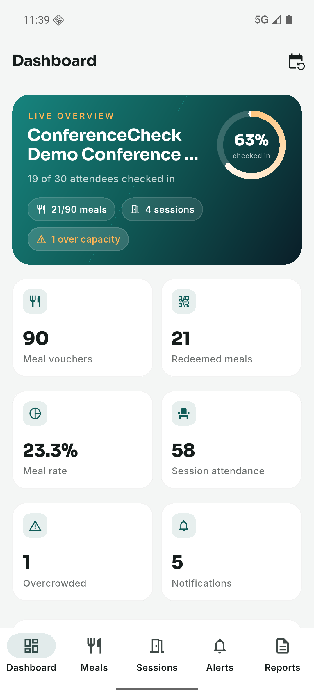
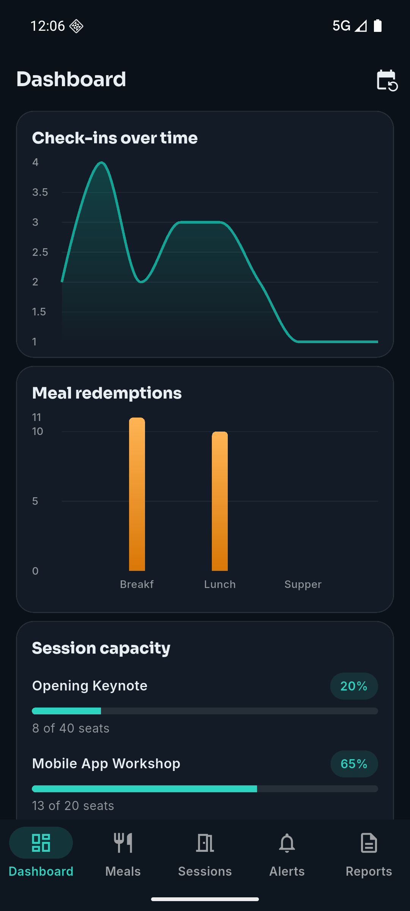
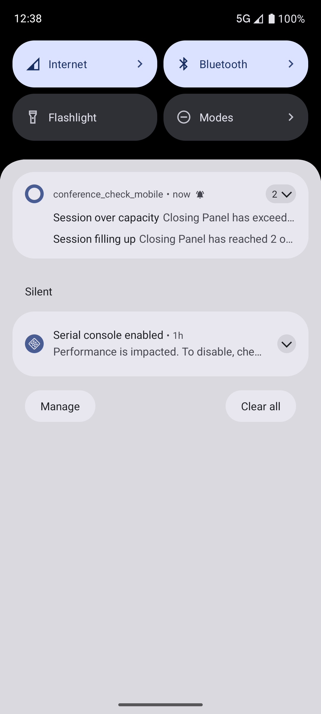
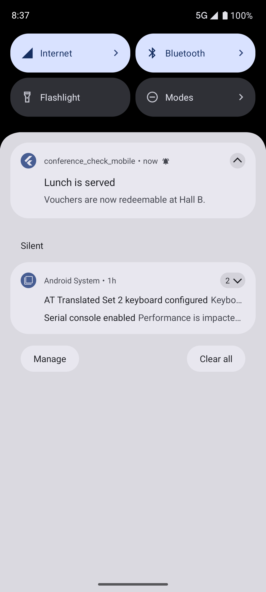
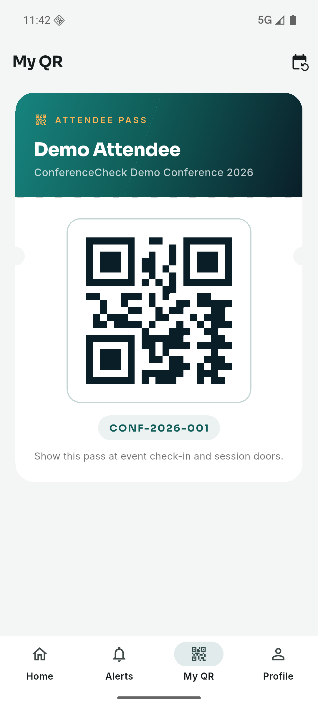
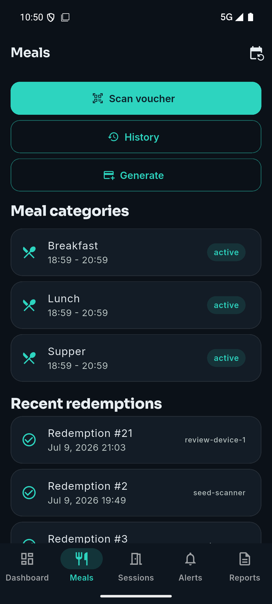
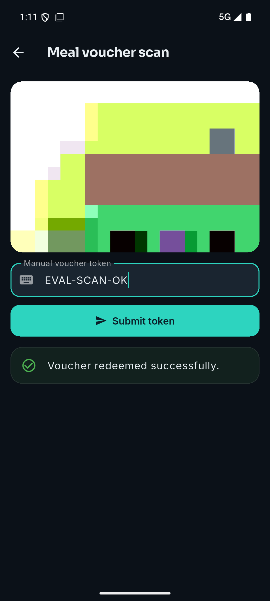
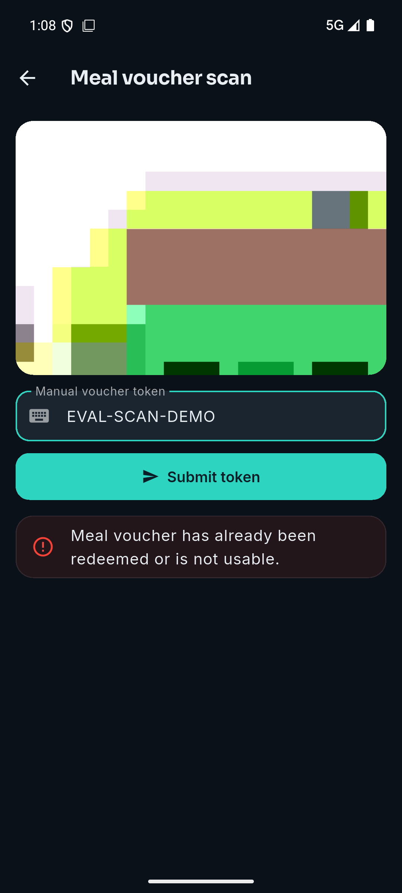
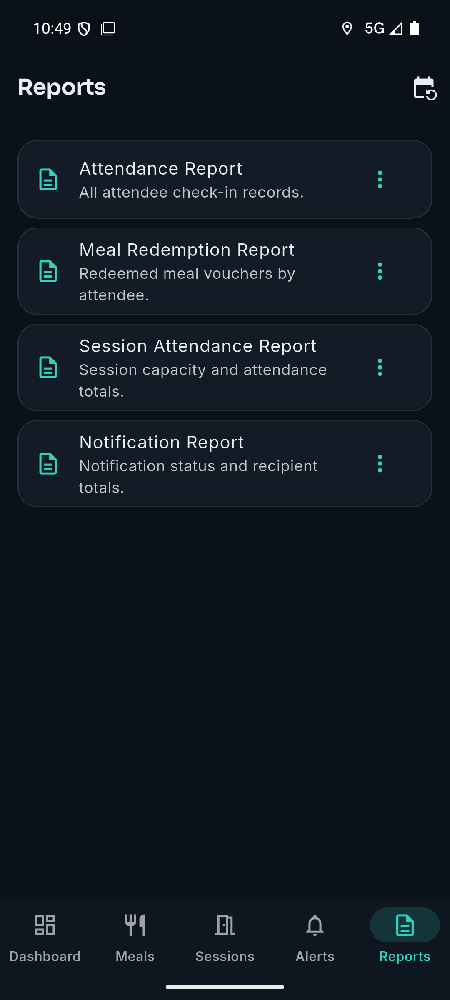

# Fraud-Resistant Meal Voucher Redemption and Real-Time Operational Analytics for Conference Management: Design and Evaluation of ConferenceCheck Mobile

**Ndashi Bwalya Chisanga**
Student number 2021470105

Submitted in partial fulfilment of the requirements of the Final Year Project, Department of Computing and Informatics
Supervisor: Mr. Mofya Phiri

October 2026

Repository: https://github.com/ndashi-chisanga6/ConferenceCheck-Mobile-Analytics-Meals-and-Notifications
Validated state: tag `final-resubmission`


## Declaration

I declare that this report is my own work. It has not been submitted, in whole
or in part, for any other award at this or any other institution, and every
source I have drawn on is acknowledged in the reference list.

The use of artificial intelligence tools during this project is disclosed in
**Appendix A**, which records what each category of tool was used for, what
was provided to it, and the limits placed on its use by Section 9 of the
project proposal. All evaluation data in this study is seeded and
synthetic: attendees, meal vouchers and sessions in the simulated-event
exercise are generated by `tools/seed-evaluation-event.php` and describe no
real conference or real person. No respondent or attendee data belonging to
any third party was uploaded to any external tool at any point.

Signed: ......................................    Date: ......................


## Conventions used in this report

Latencies are quoted in milliseconds to one decimal place in tables and
rounded to the nearest whole millisecond in prose. Counts and rejection rates
are exact throughout. Timings are wall-clock seconds or milliseconds for a
single named run on PHP 8.5.8 with PostgreSQL 18, and the run is always
named. Where a number also appears in `docs/validation_report.md`, the two
are the same measurement and that file is the reproducible source; this
report does not re-derive figures independently of it.


## Table of Contents

| Section | Title | Page |
|---|---|---|
|  | Declaration | 1 |
|  | Conventions used in this report | 1 |
|  | Abstract | 4 |
| 1 | **Introduction** | 5 |
| 1.1 | Problem statement | 6 |
| 1.2 | Aim | 6 |
| 1.3 | Objectives | 6 |
| 1.4 | Scope | 6 |
| 1.5 | Contributions | 7 |
| 2 | **Literature Review** | 7 |
| 3 | **Methodology** | 10 |
| 3.1 | System architecture and the component 4.3a / 4.3b boundary | 10 |
| 3.2 | Data model and integrity guarantees | 11 |
| 3.3 | The voucher redemption protocol | 11 |
| 3.4 | Session attendance and capacity alerting | 12 |
| 3.5 | Offline operation | 12 |
| 3.6 | Analytics, notifications and reporting | 12 |
| 3.7 | Tools and technologies | 13 |
| 3.8 | Ethical considerations and AI usage disclosure | 13 |
| 4 | **Implementation** | 13 |
| 4.1 | Code organisation | 13 |
| 4.2 | Defects found and fixed during review | 14 |
| 5 | **Evaluation Methodology** | 15 |
| 5.1 | Seeded evaluation dataset | 15 |
| 5.2 | Guarding against an artificially easy measurement | 15 |
| 5.3 | Metrics and acceptance criteria | 16 |
| 6 | **Results** | 16 |
| 6.1 | Automated correctness verification | 18 |
| 6.2 | Meal voucher redemption correctness | 19 |
| 6.3 | Session attendance and capacity correctness | 19 |
| 6.4 | Latency against the proposal's targets | 20 |
| 6.5 | Analytics dashboard freshness | 20 |
| 6.6 | Export correctness | 20 |
| 6.7 | Notification delivery | 21 |
| 6.8 | Baseline comparison, and its limits | 21 |
| 7 | **Discussion** | 22 |
| 8 | **Limitations** | 23 |
| 9 | **Conclusion** | 24 |
|  | References | 25 |
| A | **Appendix A. Artificial intelligence usage disclosure** | 27 |
| A.1 | Purpose and scope | 27 |
| A.2 | Before the supervisor's comments (to 30 September 2026) | 27 |
| A.3 | After the supervisor's comments (7 to 10 October 2026) | 27 |
| A.4 | Validation of AI-assisted output | 28 |
| A.5 | Honest statement of disclosure limitations | 28 |
| B | **Appendix B. Defects found and fixed during the strict review** | 28 |
| C | **Appendix C. Full evaluation figures** | 29 |
| D | **Appendix D. Reproduction commands** | 32 |
| E | **Appendix E. The running system, against each objective** | 34 |
| E.1 | What these figures do and do not show | 42 |
| F | **Appendix F. Reference verification record** | 43 |

## List of Tables

| Table | Title | Section | Page |
|---|---|---|---|
| 1 | Core relations and the integrity constraints underpinning system guarantees | 3.2 | 11 |
| 2 | Status of each acceptance criterion in the proposal's Table 3 | 6 | 16 |
| 3 | Adversarial and live checks, strict review | 6.1 | 18 |
| 4 | Concurrent redemption on PostgreSQL behind five server processes | 6.2 | 19 |
| 5 | Latency by endpoint against the proposal's targets | 6.4 | 20 |
| 6 | Export correctness, each CSV export against SQL run directly on the database | 6.6 | 20 |
| 7 | Status of each objective | 9 | 24 |
| B1 | Defects found during review and their fixes | B | 28 |
| C1 | Full evaluation output, `tools/evaluation-results.json` | C | 29 |
| F1 | Verification of every reference, including the one withdrawn | F | 43 |

## List of Figures

| Figure | Title | Section | Page |
|---|---|---|---|
| 1 | System architecture and the component 4.3a / 4.3b boundary | 3.1 | 10 |
| 2 | Organiser analytics dashboard | E | 34 |
| 3 | Trends and per-category redemption | E | 35 |
| 4 | Automatic capacity alerts on a device | E | 36 |
| 5 | Organiser broadcast delivered end to end | E | 37 |
| 6 | Attendee pass with a server-issued token | E | 38 |
| 7 | Meal categories and the per-device redemption trail | E | 39 |
| 8 | Scanner accepting a voucher | E | 40 |
| 9 | The same voucher refused on a second attempt | E | 41 |
| 10 | Report exports available to an organiser | E | 42 |


## Abstract

On-site conference operations, meal service, session seating and attendee
communication, are still widely managed with paper registers and printed
vouchers, processes that scale poorly and are vulnerable to
duplicate-collection fraud. This report presents the design, implementation
and evaluation of ConferenceCheck Mobile: Analytics, Meals and Notifications,
component 4.3b of a two-part conference management companion application
whose sibling component, 4.3a, delivers attendee check-in capture and
offline synchronisation separately. This project consumes check-in data
through the REST API contract agreed with 4.3a, with a minimal check-in stub
standing in for 4.3a during development, and contributes four capabilities that
carry equal weight in its evaluation: a QR-code based meal voucher protocol
in which single-use redemption is enforced in the database, by a row lock
and a per-voucher uniqueness constraint on an append-only redemption
relation, either of which alone prevents a second redemption; a
near-real-time analytics dashboard refreshed every 30 seconds; session attendance tracking with configurable capacity
thresholds and automatic overcrowding alerts; and dual-channel attendee
notifications, combining Firebase Cloud Messaging push with an authenticated
in-app feed carrying per-recipient delivery records. An offline scan queue,
whose safe replay follows from the server's idempotent scan semantics and
which keeps any scan the server has not definitively answered, extends the
design to intermittent venue connectivity. The system was
evaluated against a seeded 500-attendee event with three meal categories and a
voucher per attendee per category, ten sessions and scripted concurrent-fraud
scenarios, driven through the live API rather than through unit-level mocks.
Not every criterion in the proposal's Table 3 was met, and Table 2 of this
report gives the status of each. Duplicate redemption was refused in 100 of 100 sequential
re-scans. In a concurrency experiment on PostgreSQL behind five server
processes, every one of 50 five-way races produced exactly one redemption
whenever the row lock or the unique constraint was in place, while a plain
check-then-insert with both removed redeemed 48 of 50 vouchers more than once.
All three categories were redeemable independently for each of twenty
attendees. Median voucher-scan latency was 145.3 ms (95th percentile
261.0 ms), measured over loopback. Twenty check-ins injected at random
moments appeared on the dashboard after a median of 18.1 s and at most
28.5 s. All four CSV exports matched direct SQL queries on row counts and
totals. Capacity alerting was shown working but not timed, push delivery
across a fleet of devices was not measured, and a live, human-staffed manual
baseline was not run; these are stated as gaps rather than approximated with
fabricated figures, and the qualitative argument for the baseline rests on
the system's measured 145 ms scan-to-decision time and the fact that a paper
voucher has no server-side check to fail. The results indicate that a row lock and a
unique constraint each prevent double redemption under real parallel load,
where a plain check-then-insert does not, while keeping scan-point latency
well within interactive bounds.

## 1. Introduction

Modern conferences concentrate hundreds of attendees, multiple parallel
sessions and time-boxed catering windows into a short operational period.
The quality of the attendee experience depends on how efficiently organisers
can verify entitlement, observe live operational state, and communicate
changes as they happen. Traditional approaches rely on fragmented, largely
manual tools: printed meal tickets, paper attendance registers and
public-address announcements. These methods have three structural
weaknesses. Paper vouchers are trivially duplicated or reused, and manual
meal lines create congestion at service points. Organisers have no
consolidated, real-time view of attendance or consumption, so operational
decisions are made on stale or anecdotal information. Attendee communication
is broadcast-only and unverifiable, with no record of who received a given
update.

Quick Response (QR) codes provide a mature, standardised mechanism for
machine-readable identification [1], and QR-based attendance has been
proposed as a way to reclaim the lecture time that manual registers consume
[3]. Cloud push-messaging services such as Firebase Cloud
Messaging exist to send messages to mobile devices reliably [9], within the
delivery guarantees Section 2 sets out, and modern cross-platform toolkits such as
Flutter allow a single codebase to deliver the required scanning, charting
and notification functionality [19]. This project applies these
technologies to conference operations as component 4.3b of the
ConferenceCheck capstone programme. A sibling component, 4.3a, handles the
core attendee check-in capture and offline synchronisation engine
separately; this project does not rebuild those features, and instead
consumes check-in data through a shared REST API contract and focuses on
what happens after check-in.

### 1.1 Problem statement

Conference organisers lack integrated, trustworthy tools for the operational
tasks that follow attendee registration and check-in. Meal distribution
based on printed vouchers or name lists cannot enforce single use; duplicate
collection is difficult to detect at the point of service, and
reconciliation after the event is manual and unreliable. Attendance and
check-in data, even when captured digitally, is not surfaced to organisers
in real time, so decisions about catering quantities, room allocation and
staffing are made on guesswork. Session rooms have physical capacity limits,
but organisers have no mechanism that tracks per-session attendance as it
happens or warns them before rooms overcrowd. Communication with attendees
is one-directional and unlogged, with no record of which attendees were
reachable for a given schedule change. The consequence is operational
inefficiency, measurable fraud exposure in catering budgets, safety risk
from overcrowded rooms, and a degraded attendee experience.

### 1.2 Aim

To design, implement and evaluate the analytics, meal management, session
capacity, notification and reporting component of the ConferenceCheck
Mobile application, providing conference organisers with real-time
operational insight, fraud-resistant meal voucher redemption and auditable
attendee communication.

### 1.3 Objectives

1. To design and implement a real-time analytics dashboard showing check-in
   progress, check-in rates and trends for event organisers. "Real-time" was
   delivered as near-real-time by design: the dashboard polls every 30
   seconds (Section 3.6).
2. To build a QR-code based meal voucher scanning and redemption system
   that enforces single-use redemption across multiple meal categories.
3. To implement session attendance tracking with capacity management and
   overcrowding alerts.
4. To build a push notification system for attendee communications and
   schedule updates, with per-recipient delivery records.
5. To implement reporting and data export (CSV) functionality for event
   organisers.
6. To evaluate redemption correctness, scan latency, dashboard freshness,
   notification delivery and export correctness against the Table 3 targets
   and a manual baseline.
7. To produce comprehensive technical documentation and a
   publication-ready paper.

### 1.4 Scope

The project covers Flutter mobile modules for the analytics dashboard, meal
voucher generation and scanning, session attendance and capacity alerts, a
notification inbox and report access, together with the corresponding
server-side business logic in a standalone Laravel API. It is built against
the REST API contract agreed with component 4.3a's core check-in module,
consuming check-in data as a read-only input to analytics, with a minimal
check-in stub standing in for 4.3a so that this component can be built and
tested on its own; check-in
scanning, attendee search and the offline synchronisation engine are
component 4.3a's remit and are out of scope here. Evaluation is performed on
seeded, realistic event datasets including concurrent-scan fraud scenarios,
described in full in Section 5. Payment processing, external ticketing
integration and a full web-based administration panel are out of scope for
both components.

### 1.5 Contributions

This work makes four contributions, each carrying equal weight in the
evaluation that follows. The first is a redemption protocol in which the
single-use guarantee is carried by the database's constraint machinery: a
unique constraint on an append-only redemption relation, enforced inside a
transaction with a row lock on the voucher, rather than by an
application-level check, which eliminates time-of-check-to-time-of-use races
by construction rather than by defensive coding. The second is a
near-real-time analytics dashboard whose staleness bound is a stated design
parameter (a 30-second poll) rather than an incidental property, chosen
explicitly over introducing a WebSocket layer within the project's scope.
The third is session capacity tracking whose overcrowding alerts are
dispatched automatically on a threshold transition, converting a safety
problem into an alert delivered before a room reaches capacity rather than a
discovery made after. The fourth is a dual-channel notification design, push
plus an authenticated in-app inbox with per-recipient delivery records, that
treats Firebase Cloud Messaging's best-effort delivery model as a known
property to be compensated for rather than assumed away, together with an
offline scan queue whose replay safety is a direct corollary of the same
idempotent server design that makes the redemption protocol safe.

## 2. Literature Review

The QR Code symbology is standardised in ISO/IEC 18004 [1], which specifies
its data capacity and, critically for verification applications, its four
selectable error-correction levels, allowing codes to remain
machine-readable when partially damaged or poorly displayed on
low-brightness screens. Tiwari [2] surveys the structural properties that
drove QR adoption over one-dimensional barcodes in ticketing and
access-control contexts: high capacity in a small print area, omnidirectional
scanning, and decode robustness on commodity camera hardware. A key design
implication, adopted in this project, is that the QR payload should be an
opaque server-issued token rather than semantically meaningful data, so that
possession of the printed code confers no information and validation
authority remains entirely server-side.

Masalha and Hirzallah [3] propose a QR-based attendance system for a
university setting, motivated by the observation that taking attendance
manually consumes around ten minutes of each lecture, and they project that
their design would remove most of that cost. Their paper describes the design
and analyses it; it reports no experiment, and in particular no measured
comparison against a manual register, so it should not be read as evidence of
how much time or error such a system saves in practice. Its analysis does,
however, identify the central weakness of naive QR attendance directly: a
student outside the room can be sent an image of the displayed code by a
student inside it, so any anti-fraud property must come from what the server
does with a scan, not from the code itself. Their own answer to that is to
bind the scan to a place and a person, through device location and a facial
match. That weakness, rather than their proposed remedy for it, is what
motivates the server-side single-use redemption design evaluated in this
report, in which the database, not the scanning client, is the arbiter of
whether a voucher has already been consumed.

That weakness has not gone away in the decade since, and the recent literature
answers it by constraining the scan rather than the entitlement. Mohammed and
Zidan [4] regenerate the code twice a second, so that a code which has been
photographed is already stale by the time it is presented again; they report
improved accuracy and a positive reception from students and instructors,
drawn from surveys and record analysis rather than from a controlled
comparison. Nwabuwe et al. [5], writing in the same journal as Masalha and
Hirzallah nine years later, still describe a shared code as the central
vulnerability, and bind the scan to a place and a device: the venue's
polygonal coordinates are encoded in the code itself and checked by geofence,
and the registering handset's IMEI is verified so that one person cannot
register for another. Alsuhibany [6] secures the symbol instead of the scan,
embedding a watermark so that a substituted or tampered code can be detected,
and reports high accuracy over a dataset of 5,000 samples.

Each of these binds the act of scanning more tightly, to the moment, the
place, the device or the integrity of the symbol, and each is a reasonable
answer to the problem it takes on. None of them makes the thing being claimed
single-use, which is a different guarantee and the one this project pursues.
The distinction is in what is being recorded: an attendance mark may
legitimately be registered once per person per session, and the fraud is
someone registering who is not there, whereas a meal entitlement is consumed,
and the fraud is the same person consuming it twice. Binding a scan to a place
or a handset does not prevent the second of these, because the attendee is
genuinely present and holding their own phone both times.

It is also worth recording what this body of work does not contain. None of
[4], [5] or [6] reports a measured comparison against a manual process, and
neither does [3]. Section 6.8 therefore has no external figure to set its own
against, and says so rather than implying that one exists.

For the redemption transaction itself, Helland [16] provides the canonical
treatment of idempotence in distributed systems: operations that may be
retried, as scans on unreliable venue networks will be, must be designed so
that repeated submission cannot produce repeated effect. In this project,
that principle is realised by recording redemptions in an append-only table
with a database-level uniqueness constraint on the voucher identifier,
making double-redemption a constraint violation rather than an
application-level race condition, and it is the same property that makes
the offline scan queue described in Section 3.5 safe to replay without
reconciliation logic.

Helland's argument concerns repeated submission; the harder case is
simultaneous submission. Berenson et al. [20] name the underlying anomaly the
lost update: one transaction reads a data item, another updates it, and the
first then writes on the basis of what it read. A redemption that checks a
voucher's status and then marks it redeemed has exactly this shape, and an
application-level status check cannot close it, because two transactions can
both read the unredeemed status before either writes. Two database mechanisms
can. A row lock taken with `SELECT ... FOR UPDATE` makes any other transaction
that tries to lock or update the same row wait until the first transaction
ends [21], so the second reader sees the committed redemption. A unique index
makes a second insert of the same key wait for the first inserting
transaction, and fail if that transaction commits [22]. Section 6.2 tests each
mechanism on its own, and the two together, against the case they are meant
to prevent.

On the presentation side, Few [7] establishes design principles for
operational dashboards: a dashboard must fit on a single screen, prioritise
the small number of measures that drive action, and use visual encoding
rather than tables of numbers for trend perception. Nielsen [8] provides the
response-time thresholds that inform this project's latency targets:
feedback within one second preserves a user's flow of thought, which sets
the budget for scan-validation round trips at a catering service point where
queue throughput matters, and is the threshold against which Section 6.4
reports the measured results.

For attendee communication, Firebase Cloud Messaging documentation describes
an architecture in which each app instance registers for messages and is
identified by its own registration token [10], and states that a message
accepted by FCM has not thereby been delivered: a message for an offline
device is stored and delivered when the device reconnects, and delivery may be
delayed or may not happen at all [11]. Delivery is therefore best-effort rather
than guaranteed, tokens expire, and devices
without Google Play services are unreachable, all of which motivate the
dual-channel design evaluated in Section 6.7, in which every notification is
also persisted to an in-app inbox with per-recipient delivery records. The
service interface between the mobile client and backend follows the REST
architectural style [12]; endpoint authentication uses bearer tokens as
specified in RFC 6750 [13] and implemented by Laravel Sanctum [14], with
mobile-specific hardening guided by the OWASP Mobile Application Security
Verification Standard [15]. The client architecture applies the separation
of presentation, state and data access descended from the Model-View-
Controller pattern [17], realised in Flutter's widget and provider model
[19].

Taken together, this body of work indicates that the individual technologies
are mature, but that existing systems apply them piecemeal: attendance tools
do not manage catering, catering tools do not track session capacity, and
none provide the organiser with a consolidated live operational view. This
project's contribution, set out in Section 1.5, is that integration, with
each design decision traceable to a specific finding in this literature
rather than to convention.

## 3. Methodology

### 3.1 System architecture and the component 4.3a / 4.3b boundary

The system is a client-server architecture with three tiers: a Flutter
mobile application, a standalone Laravel backend exposing a REST API [12], and
a PostgreSQL database, with Firebase Cloud Messaging as the external push
channel.

**Figure 1. System architecture and the component 4.3a / 4.3b boundary.**

| ConferenceCheck Mobile: Flutter application (Android) | |
|---|---|
| **Component 4.3a: Core Check-in and Sync Engine** *(sibling, developed separately, out of scope)*: attendee check-in capture; offline synchronisation engine | **Component 4.3b: Analytics, Meals and Notifications** *(this project)*: analytics dashboard; meal voucher scan and redemption; session capacity and overcrowding alerts; notification inbox; reports and CSV export |
| REST API contract agreed with 4.3a, Sanctum bearer-token authenticated. 4.3b consumes check-in data from seeded fixtures and a minimal check-in stub during independent development | |
| **Standalone Laravel REST API implementing the agreed contract, with a minimal check-in stub + PostgreSQL database** | |
| Push dispatch: Laravel → Firebase Cloud Messaging (external) then to the device, for component 4.3b notifications only | |

The mobile application follows a layered structure derived from the
Model-View-Controller separation [17]: a presentation layer of Flutter
widgets, a state layer of Riverpod providers holding screen state and
orchestrating asynchronous calls, and a data layer of repository classes
wrapping a single authenticated REST client. Platform services, camera
access via `mobile_scanner` and push token registration via
`firebase_messaging`, are isolated behind interfaces so that they can be
stubbed in widget tests. The backend is a standalone Laravel 13 application,
started from the Laravel starter kit, that implements the API contract agreed
with component 4.3a, with a minimal check-in stub so that this component can be
built and tested on its own. Every endpoint requires a Sanctum-issued bearer
token [13, 14] and returns a uniform JSON envelope with `success`, `message`
and `data` fields. Authorisation is role-based and scoped to the event:
organisers manage the event, view analytics and download reports; scanners
submit scans and read the attendee list, vouchers and redemption history the
scanner app needs; attendees read only their own vouchers and the
notifications sent to them. The first submitted version did not enforce the
attendee restrictions on four routes; Section 6.1 describes the defects and
the tests that now cover them.

### 3.2 Data model and integrity guarantees

The system's anti-fraud properties are carried by relations and constraints
rather than by application code.

**Table 1. Core relations and the integrity constraints underpinning system
guarantees.**

| Relation | Purpose | Key integrity constraint |
|---|---|---|
| `attendees` | Event attendee records, shared with 4.3a | Unique `ticket_code`; unique `qr_token` |
| `meal_categories` | Meal windows, for example Breakfast, Lunch, VIP Lunch | Owned by event; time-windowed |
| `meal_vouchers` | One voucher per attendee per category | Unique `qr_token`; unique `(attendee, category)` pair |
| `meal_redemptions` | Append-only record of each redemption; the model refuses updates and deletes | Unique `meal_voucher_id` enforces single use; foreign keys restrict rather than cascade deletes |
| `event_sessions` / `session_attendance` | Conference sessions and per-session attendance | Unique `(session, attendee)` prevents duplicate attendance |
| `device_tokens` / `notification_recipients` | FCM registration and per-recipient delivery records | Delivery auditable per user and per notification |

### 3.3 The voucher redemption protocol

Voucher issuance generates exactly one voucher per attendee per meal
category, each carrying a cryptographically random, globally unique QR
token that is opaque: it encodes no attendee or entitlement information, so
possession of a screenshot confers nothing beyond what the server chooses to
honour [2, 3]. The protocol has four steps. A scanner device decodes the QR
token and submits it with its own device identifier to the scan endpoint.
The server resolves the token to a voucher, verifying that it belongs to the
event being served and that the category's service window is open. Within a
database transaction, the server locks the voucher row
(`lockForUpdate()`), so a second scan of the same voucher waits until the
first transaction ends. It then checks that the voucher is still unused; a
scan that finds it already redeemed receives a definitive "already redeemed"
response naming the earlier redemption time [16]. Only then does it mark the
voucher redeemed and insert the redemption record. The unique constraint on
the record's voucher identifier is a second, independent guarantee: if the
lock were ever missing, the second insert would fail, and that failure is
caught and returned as the same "already redeemed" response rather than as a
server error. The redemption record, including the redeeming device
identifier and timestamp, cannot be changed afterwards: the model refuses
updates and deletes, and the foreign keys restrict, rather than cascade, the
deletion of the event, attendee, category, voucher or user it refers to, so it
remains a complete audit trail for post-event reconciliation. Section 6.2
measures the protocol under real parallel load, including with each of the
two guarantees removed.

### 3.4 Session attendance and capacity alerting

Each session carries a room capacity. Attendee entry is recorded by scanning
the attendee's QR badge at the session door; the unique `(session,
attendee)` constraint prevents double counting. The backend evaluates
occupancy against capacity on every scan, under a lock on the session row
that serialises scans of one session, and exposes threshold states:
`available`, `warning` at or above a configurable fraction of capacity
(default 90%), and `over_capacity`. A threshold transition dispatches an
organiser-targeted push notification after the attendance transaction
commits, so a push is never sent for attendance that ends up rolled back,
converting room overcrowding from a discovery made after the fact into an
alert intended to arrive before the room reaches capacity; Section 6.3
states how far that was shown.

### 3.5 Offline operation

Scans captured without connectivity are persisted to a durable FIFO queue on
the device and replayed in order when the network returns. Replay safety is
a direct corollary of the server's idempotent scan semantics described in
Section 3.3: an entry that already reached the server resolves to a
definitive duplicate answer rather than a second effect, so the queue can be
drained without reconciliation logic. A definitive business answer settles
an entry: success, already redeemed or duplicate (409), invalid token (404),
or not redeemable now (422). Anything else, including no connection, an
expired login, rate limiting or a server fault, keeps that entry and every
entry after it for the next attempt, and an entry queued while a replay is
running is kept. The replay tests are listed in Section 6.1.

### 3.6 Analytics, notifications and reporting

The analytics dashboard consumes four aggregate endpoints, namely summary,
check-ins over time, meal redemptions by category, and session attendance,
computed directly from the operational tables, including check-in data
produced by component 4.3a. Following Few's single-screen principle [7], the
landing view presents total registrations, check-in count and rate, and
voucher redemption progress as headline figures, with time-series charts
beneath. The client self-refreshes on a 30-second polling interval, a
deliberate trade-off documented in Section 8: polling over the existing REST
API avoids introducing a WebSocket layer while keeping data staleness within
one operational decision cycle. Section 6.5 measures the resulting freshness
by injecting check-ins and timing their appearance.

Organisers compose notifications targeted at all attendees or at
role-scoped groups. The dispatch service resolves the target set into
per-recipient delivery records, then delivers via Firebase Cloud Messaging
to every registered device token [10]. Because FCM delivery is best-effort
[11], every notification is simultaneously persisted and served through an
authenticated in-app inbox, so an attendee whose device was offline, or
lacks Google Play services, still receives the message on next application
open; the inbox shows each user only the notifications they were a recipient
of, and the per-recipient records make delivery auditable. Firebase demo
mode, used to try the app without credentials, records a send as `demo` on
the notification and every recipient, never as `sent`, so it cannot be
mistaken for delivery.

The reporting module exposes CSV exports of attendance, per-category meal
redemptions, per-session attendance and notifications to organisers. Each
export is written while its rows are read from the database in chunks of
1,000, so the whole export is never held in memory. Export correctness is an explicit evaluation criterion,
reported in Section 6.6.

### 3.7 Tools and technologies

Mobile: Flutter 3.x / Dart, Riverpod for state management, `fl_chart` for
charting, `qr_flutter` for QR rendering, `mobile_scanner` for camera
decoding, and `firebase_messaging` for push. Backend: Laravel 13 (PHP), started
from the Laravel starter kit, Laravel Sanctum for token authentication, and
PHPUnit for API tests. Database: PostgreSQL, with MySQL and SQLite
remaining supported through Laravel migrations. Infrastructure: Firebase
Cloud Messaging, Git for version control.

### 3.8 Ethical considerations and AI usage disclosure

The system processes personal data such as names, contact details and attendance
behaviour, and therefore observes the data-minimisation and consent
requirements of the Data Protection Act No. 3 of 2021 of Zambia [18].
Attendee records hold only fields required for event operations, QR tokens
are opaque and carry no personal data, API access is authenticated and
role-scoped following OWASP MASVS
guidance [15], and evaluation is performed exclusively on synthetically
seeded data, so no real attendee data was processed during development or
evaluation. Client-server traffic must be encrypted in any deployment; the
development build talks to a local server over plain HTTP (Section 8). The
system should not be demonstrated with real attendee data until the
deployment hardening listed in Section 8 is done. The use of artificial
intelligence tools is disclosed in **Appendix A**, against the scope limits
set out in Section 9 of the project proposal (v3, resubmitted on 23 September
2026 and under review).

## 4. Implementation

### 4.1 Code organisation

**What in this repository is this component's work.** The repository is a
standalone Laravel 13 application, started from the Laravel starter kit, so it
also carries the starter kit's own pages, settings and authentication code and
their 39 tests, none of which is this component's work. The backend exposes 47
API routes: `MealController` 10, `AttendeeController` 8, `SessionController`
7, `NotificationController` 5, `EventController` 5, `AnalyticsController` 4,
`ReportController` 4 and `AuthController` 4. Two of those, the check-in scan
and check-in endpoints on `AttendeeController`, are a minimal stub for
component 4.3a's check-in capture, written here so this component can be built
and tested on its own; this component only reads check-in data, for analytics,
and integration with 4.3a's own API was not demonstrated. `AuthController` and
`EventController` are the authentication and event scaffolding both components
need. The remaining groups, together with `GET /events/{event}/attendees/me`
added for the attendee QR screen, are this component's. The mobile application
is this component's alone, and its feature modules bear the boundary out
directly: `mobile/lib/features/` holds `dashboard`, `meals`, `sessions`,
`notifications`, `reports`, `attendee`, `events`, `auth`, `profile` and
`sync`, with no check-in capture module anywhere in it.

**How the history and tags should be read.** The git history before 10 July
2026 was reconstructed from the working prototype in one session (9 and 10
July, with follow-on commits to 14 July), grouping the development done
before then into module-by-module commits; `docs/milestone_tracker.md` and
`docs/STRICT-REVIEW.md` record this. The milestone tags were created in
September and mark the commit that best represents each phase's deliverable,
not the dates in the proposal's Table 4, so they do not by themselves show when
the work happened. The work done after the supervisor's comments on the first
submission is listed with its commit dates in `docs/remaining_work.md`.

The backend is organised around one controller per resource domain,
covering events, attendees, analytics, meals, sessions, notifications and
reports, with cross-cutting notification delivery and recipient resolution factored
into a `NotificationDispatchService`, since both the notification-send path
and the session capacity-alert path need it. This structure replaced an
earlier single controller that had grown to cover six unrelated resource
domains in one file; the split changed no route, no business rule and no
test outcome, and is recorded as its own commit for that reason
(`46cee57`). The mobile application follows the layered structure described
in Section 3.1. Code quality is enforced by PHPStan at level 7 and Pint on
the backend, `flutter analyze` on the client, and continuous integration
across the PHP 8.4 and 8.5 matrix; all are clean at the time of writing.

### 4.2 Defects found and fixed during review

A strict, evidence-based review of the system against the portal objectives
and the proposal was carried out by the student partway through development,
with assistance from Claude (Appendix A), using the full
backend test suite, live adversarial API calls, `flutter analyze` and
`flutter test`, and code inspection of every claimed safeguard
(`docs/STRICT-REVIEW.md`). Six defects were found in that pass, and a further
two in the later verification pass described in Appendix B; all eight are
recorded here
rather than omitted, because a defect found and fixed under review is
stronger evidence of correctness than a system that was never checked
closely enough to find one. Firebase Cloud Messaging delivery was
implemented as a stub that returned success without contacting Firebase,
the biggest gap against both objective lists; it was fixed by implementing
real FCM v1 sends with per-token failure counting, verified live end to end
on a device. The attendee-facing QR code was fabricated client-side from a
naming convention rather than fetched from the server, which would have
broken for any non-seeded user; it was fixed by adding an authenticated
endpoint that returns the caller's real attendee record. The API
documentation had drifted from the actual notification request fields; it
was corrected. Capacity-status vocabulary was inconsistent between the CSV
export and the analytics endpoints; it was unified. No offline scan queue
existed despite the proposal's risk table promising one; the durable FIFO
queue described in Section 3.5 was built to close that gap. Mobile test
coverage was thin, at four tests across roughly fifteen screens; it was
broadened to nineteen tests covering the offline queue's persistence,
ordering and replacement semantics, core widgets, formatters and model
parsing, and later to twenty-seven with the replay tests described in
Section 6.1. That review did not find the authorisation and replay defects
the supervisor later identified; those, and their fixes, are in Section 6.1. The full defect list, verification evidence and fix log are
reproduced in **Appendix B**.

## 5. Evaluation Methodology

Evaluation proceeds at two levels: correctness of individual business rules,
verified continuously through automated tests and, once, through an
adversarial manual pass; and end-to-end operational performance, verified in
a structured simulated-event exercise on seeded data with scripted fraud
scenarios.

### 5.1 Seeded evaluation dataset

The evaluation dataset is generated by `tools/seed-evaluation-event.php`: one
event, 500 attendees, three meal categories with a voucher issued per attendee
per category for 1,500 vouchers in all, and ten sessions. Three categories
rather than one because the single-use guarantee is held per (attendee,
category): with one category nothing would distinguish it from a per-attendee
guarantee, and the second project objective is redemption across several.
The proposal specified four categories for the simulated event; three were
used, which is enough to test that redeeming one category leaves the others
redeemable, and the proposal's targets are kept unchanged. The dataset is
driven through the live HTTP API, against a running backend, rather than
through unit-level mocks or direct database manipulation, so that the
measured latencies include routing, middleware, authentication and
serialisation overhead exactly as a real scanner client would experience
them. Three scripts do this: `tools/run-evaluation.py` for correctness,
latency and export correctness, `tools/run-concurrency-experiment.py` for
redemption under parallel load, and `tools/measure-dashboard-freshness.py`
for dashboard freshness.

### 5.2 Guarding against an artificially easy measurement

Three design choices keep this evaluation from measuring only what the system
was built to pass.

First, the concurrency claim is tested by an experiment that can fail. A race
test run on a server that executes one request at a time cannot tell a
locked, constrained redemption apart from a plain check-then-insert, because
the requests never overlap: every losing scan is refused by the ordinary
status check. The first version of this evaluation had exactly that weakness.
The concurrency experiment therefore runs five separate PHP server processes
against PostgreSQL, sends each race's five scans to a different process at the
same instant, and repeats the races with the row lock removed, with the unique
constraint removed, and with both removed, each configuration served from a
scratch copy of the same commit. The configuration with both removed is the
negative control: if it also produced one redemption per race, the test would
show nothing. A second run injects a 50 ms pause between the check and the
write in every configuration, so the result does not depend on how often the
natural timing happens to overlap.

Second, freshness is measured by injecting check-ins and timing their
appearance through a poller that reproduces the app's refresh cycle, rather
than derived from the poll interval.

Third, export correctness is checked against SQL run directly on the
database, not against another API endpoint that could share a fault with the
export, and on a total per export as well as on the row count.

The adversarial pass recorded in `docs/STRICT-REVIEW.md` and reproduced in
Appendix B was conducted separately from, and before, the quantitative round
in Section 6, using live API calls with invalid QR tokens, wrong roles and
missing authentication. It did not find the authorisation defects described in
Section 6.1, which were found by the supervisor after submission.

### 5.3 Metrics and acceptance criteria

Success criteria were set in the proposal's Table 3: 100% of
duplicate scans rejected including concurrent submissions; median scan
latency under 500 ms with a 95th percentile under 1 second; dashboard data
no more than 30 seconds behind database state; a capacity warning delivered
before a session reaches 100% occupancy; 95% or more of online devices
receiving a push within 30 seconds, with 100% of recipients reachable via
the in-app inbox on next open; and CSV export row counts and totals equal to
database ground truth exactly; and a comparison with a manual baseline. Each
criterion is given a status in Table 2 and addressed by name in Section 6.

## 6. Results

**Table 2. Status of each acceptance criterion in the proposal's Table 3. Sources:
`tools/evaluation-results.json`, `tools/concurrency-results.json`,
`tools/freshness-results.json`.**

| Criterion (proposal Table 3) | Target | Result | Status |
|---|---|---|---|
| Duplicate redemption rejection, including concurrent submissions | 100% | 100/100 sequential re-scans refused; on PostgreSQL behind five server processes, 50/50 five-way races with exactly one redemption with the lock, the constraint or both in place; with both removed, 48/50 vouchers redeemed more than once (Section 6.2) | Met |
| Scan validation latency | median < 500 ms, p95 < 1 s | voucher scan 145.3 ms / 261.0 ms (n=200); session scan 128.4 ms / 228.7 ms (n=40) | Met on loopback only (Section 8) |
| Dashboard freshness | ≤ 30 s behind the database | 20 injected check-ins: median 18.1 s, p95 28.4 s, max 28.5 s, 20/20 within 30 s | Met in the measured run; by design the worst case is one 30 s cycle plus a fetch, fractionally over 30 s (Section 6.5) |
| Capacity warning before 100% occupancy | warning delivered before full | two automated transition tests; one observation on an emulator | Partly met: shown, not timed |
| Push delivery | ≥ 95% of online devices within 30 s | one device, one observed delivery of about 5 s | Not measured |
| In-app inbox reach | 100% of recipients on next open | a recipient record for every recipient, inbox reads filtered to recipients and tested; not measured on devices | Partly met |
| Export correctness | row counts and totals equal to the database | all four exports equal to direct SQL on row counts and on a total each (Section 6.6) | Met |
| Comparison with a manual baseline | measured against a staffed paper line | not run (Section 6.8) | Not run |

Two further results are not Table 3 criteria but test the guarantees the
design rests on: all three categories were redeemable independently for 20 of
20 attendees, and 20 of 20 sequential duplicate session scans were refused.
Four criteria are met, one of them on loopback only; two are partly met; push
delivery across a fleet was not measured; and the manual baseline was not
run.

### 6.1 Automated correctness verification

The backend test suite passes in full: 70 tests, 288 assertions, on PHP 8.5.8
with PostgreSQL 18.2. Of those, 31 tests (152 assertions) in
`tests/Feature/ConferenceApiTest.php` exercise this component; the other 39
are the Laravel starter kit's example, dashboard, authentication and settings
tests, which came with the application scaffold. The 31 are named in Section
0.1 of the validation report. PHPStan at level 7 and Pint are both clean. The
Flutter client is analyzer-clean with 27 of 27 tests passing.

**Access control.** After submission the supervisor found that an
authenticated attendee assigned to the event could read another attendee's
voucher token, the attendance export, the event's redemption history and a
notification addressed to organisers, on a local database with synthetic data.
These were defects in the authorisation rules, contradicting what Section 3.1
then claimed. They are fixed: an attendee can open only their own voucher,
reports are organiser only, the redemption history, attendee list, voucher
list and session attendance are staff only, and notifications are listed and
opened only by their recipients. Four further defects of the same kind were
fixed with them: registration let a caller choose the organiser role, any
organiser could delete any user's device token, the `custom` notification
target was sent to every attendee, and linking an attendee record to a scanner
demoted them. Each fix has a test that expects 403 and that fails against the
earlier code (validation report, Section 7).

**Offline replay.** Two defects in the replay path were fixed: every HTTP
error, including an expired login or a server fault, was treated as settled
and the scan dropped; and a scan queued while a replay was running could be
overwritten. Eight tests now drive the replay itself with a fake API,
covering an authentication failure, a server fault, a scan queued during a
replay, a queue left by an earlier app run, and a scan kept after a 401
surviving a restart (validation report, Section 8). Camera decoding of QR
codes was checked by hand and not measured; the only QR test covers the
trimming of a manually entered token.

Beyond the automated suite, the adversarial checks from the strict review
confirmed behaviour under conditions the unit tests did not then exercise.

**Table 3. Adversarial and live checks, strict review
(`docs/STRICT-REVIEW.md`).**

| Verification | Result |
|---|---|
| Live API exercise, all endpoint groups | all responded correctly, including 401/403 enforcement for the checks made |
| Double meal-voucher scan | rejected |
| Duplicate check-in / session scan | flagged `duplicate: true` / rejected |
| Over-capacity session scan | recorded with `over_capacity`, warning, and an automatic organiser alert |
| Notification send to `all_attendees` | recipient records created, per-recipient delivery status recorded |
| Four CSV report downloads | all well-formed |

### 6.2 Meal voucher redemption correctness

Sequentially, 100 of 100 re-scans of an already-redeemed voucher were refused.

The evaluation script's own race step, 20 races of five simultaneous scans of
one token, resolved to exactly one success each, but it ran on a development
server that executes one request at a time, so it cannot distinguish the
design from a plain check-then-insert and is not the evidence for the
concurrency claim (Section 5.2). The evidence is the concurrency experiment,
in which five separate server processes received each race's five scans at
the same instant, 50 races per configuration (Table 4).

**Table 4. Concurrent redemption on PostgreSQL behind five server processes,
50 races of five simultaneous scans per configuration. Source:
`tools/concurrency-results.json`.**

| Row lock | Unique constraint | Races with one success | Vouchers redeemed more than once | With a 50 ms window: one success / redeemed more than once |
|---|---|---|---|---|
| on | on (as built) | 50/50 | 0 | 50/50 / 0 |
| off | on | 50/50 | 0 | 50/50 / 0 |
| on | off | 50/50 | 0 | 50/50 / 0 |
| off | off | 2/50 | 48 | 0/50 / 50 |

With both safeguards removed, 48 of 50 vouchers were redeemed more than once
even without the injected pause, so the race is real under this load and the
experiment can detect it. With either safeguard in place, every race produced
exactly one redemption and no response was a server error. Each safeguard is
therefore sufficient on its own, and the system as built carries both: with
the lock in place, losing scans wait for the winner and are then refused by
the status check; the unique constraint refuses the second insert if the lock
is missing.

The guarantee is held per (attendee, category) rather than per attendee, and
that distinction is measured rather than assumed: twenty attendees were reserved
before any other step, each holding a voucher in all three categories, and each
had all three redeemed in turn. All sixty redemptions were accepted and every
repeat of the first was refused, so redeeming one category neither consumes nor
blocks another. Ground truth is exact: 280 redemption rows exist for 200
successful batch scans, 20 race winners and 60 cross-category redemptions,
equal to a direct SQL count.

### 6.3 Session attendance and capacity correctness

The unique `(session, attendee)` constraint held under the same sequential
treatment: 20 of 20 duplicate session check-ins were refused. Session scans now
lock the session row, and a scan that reaches the unique constraint returns
409 rather than a server error; that path is tested by inserting a competing
row between the check and the insert, but the session path was not part of
the parallel experiment, so it has not been tested under real parallel load.
Capacity threshold transitions are covered by an automated test and were
observed once on an Android emulator, where crossing the 90% warning threshold
delivered a push to the organiser before the over-capacity state was reached.
The alert was not timed, so the criterion that the warning arrives before the
session is full is shown, not measured.

### 6.4 Latency against the proposal's targets

**Table 5. Latency by endpoint against the proposal's targets. Source:
`tools/evaluation-results.json`.**

| Endpoint | n | Mean | Median | p95 | Max | Target (median / p95) |
|---|---|---|---|---|---|---|
| Meal voucher scan | 200 | 164.0 ms | 145.3 ms | 261.0 ms | 316.6 ms | < 500 ms / < 1,000 ms |
| Session scan | 40 | 143.3 ms | 128.4 ms | 228.7 ms | 242.1 ms | < 500 ms / < 1,000 ms |
| Analytics summary | 20 | 124.0 ms | 117.9 ms | 138.7 ms | 208.2 ms | part of each dashboard refresh (Section 6.5) |

Every measured latency clears its target against Nielsen's response-time
threshold [8]. These figures are taken on a single local machine over loopback
HTTP, not on venue Wi-Fi as the proposal's target scenario assumes; Section 8
states the spread across runs and what follows from the difference.

### 6.5 Analytics dashboard freshness

Freshness was measured by injecting check-ins and timing their appearance, as
the proposal's method describes. A poller reproducing the app's refresh, the
same four endpoints fetched in parallel with the next refresh 30 seconds after
the previous one started, ran while 20 check-ins were injected one at a time at
random moments; each was timed from the start of the injecting request to the
end of the first dashboard fetch that showed it. The median was 18.1 s, the
95th percentile 28.4 s and the maximum 28.5 s, and all 20 appeared within
30 s. This covers the data path to the app, not the time Flutter takes to
repaint. By design the worst case is one full 30 s cycle plus the duration of
a fetch, so a check-in landing just after a fetch starts can appear
fractionally later than 30 s; none of the 20 random trials did, but the design
does not guarantee a strict 30 s ceiling.

### 6.6 Export correctness

**Table 6. Export correctness, each CSV export against SQL run directly on
the database. Source: `tools/evaluation-results.json`.**

| Export | Check | CSV | SQL |
|---|---|---|---|
| `attendance.csv` | rows / attendees checked in | 500 / 40 | 500 / 40 |
| `meals.csv` | rows / redemptions per category | 280 / 94, 93, 93 | 280 / 94, 93, 93 |
| `sessions.csv` | rows / attendance per session | 10 / equal for all ten | 10 / equal for all ten |
| `notifications.csv` | rows / total recipients | 0 / 0 | 0 / 0 |

All four exports equal the database on their row count and on one total each.
The evaluation event has no notifications, because sending one would have used
live Firebase credentials, so the `notifications.csv` check compares zero with
zero; that export's row count is tested on seeded data that does contain a
notification. An earlier version of this check compared two exports with
other API endpoints on row counts only, which could not have caught a fault
shared between the export and those endpoints.

### 6.7 Notification delivery

Live Firebase Cloud Messaging v1 delivery was observed once, end to end, on an
Android emulator: an organiser send travelled from Laravel, through
service-account OAuth and FCM v1, to the device's notification shade, and
arrived about 5 seconds after sending. These are single observations, with the
screenshot as evidence, and no run log of delivery across devices was
committed. The proposal's target of 95% of online devices within 30 seconds
therefore requires a measurement this evaluation does not provide. Delivery is
recorded per recipient, a recipient being `sent` only when one of their own
tokens was accepted, and a demo-mode send is recorded as `demo`, never `sent`.
Because push delivery is best-effort by design [11], the in-app inbox is the
channel that reaches every recipient who opens the application; that every
recipient gets a record and that the inbox is filtered to recipients is
tested, but it was not measured on devices.

### 6.8 Baseline comparison, and its limits

The proposal's evaluation plan calls for comparing the voucher module
against a simulated, human-staffed paper-register meal line. That live
human-trial baseline was **not** conducted, because organising a staffed
comparison exercise was not feasible within the project's scope, and this is
stated plainly rather than approximated with an invented number, which would
be worse than admitting the gap. What the evaluation does establish is the
system-side bound: a median scan-to-decision time of 145.3 ms with
single-use enforcement that a paper register cannot provide at any speed,
since a photographed or reused paper voucher has no server-side check to
fail. The evaluation run refused all 200 duplicate submissions it made: 100
sequential re-scans, the 80 losing scans of the 20 single-server races, and 20
cross-category repeats; in the concurrency experiment, every losing scan was
refused in every configuration with a safeguard in place. No published figure
is available to compare these against: the closest prior work [3] proposes a
QR attendance system without measuring one, so there is no external baseline
in the literature to set these numbers beside.

## 7. Discussion

The central design argument tested by this evaluation is that a correctness
guarantee should not rest on application logic that checks for a condition
before acting on it, because two requests can both pass the check before
either acts. Table 4 shows that race happening: with the row lock and the
unique constraint both removed, five simultaneous scans of one voucher
produced more than one redemption in 48 of 50 races, although the status
check was present throughout. It also shows that either database mechanism
closes it on its own. The row lock does so by making the second request wait
until the first has committed, so its status check sees the redemption; the
unique constraint does so by refusing the second redemption row outright,
whatever the application did before the insert. The system carries both, so
that the guarantee does not depend on any one line of application code being
right. The same property is what makes the offline scan queue in Section 3.5
safe without reconciliation logic, because an idempotent server means a queue
can simply retry until it gets a definitive answer, whatever that answer is,
rather than needing to reason about whether an earlier attempt already
succeeded.

The first version of this evaluation did not show this. Its race test ran on a
server that executes one request at a time, so every losing scan was refused
by the status check and the test would have passed for a plain
check-then-insert too. The lesson is a methodological one: a concurrency test
needs a negative control that is expected to fail, or a pass means nothing.

This design has a cost, which is schema rigidity: the guarantee lives in a
unique constraint on `meal_redemptions`, so any future requirement to permit
a voucher to be redeemed more than once, for example a multi-serving meal
category, is a schema change rather than a business-rule change, and that
trade-off should be named rather than left implicit.

The latency results in Section 6.4 show that this correctness comes at an
acceptable cost at the scale tested: the measured median voucher scan of
145.3 ms leaves roughly 355 ms against the 500 ms target for the network
latency that venue Wi-Fi would add and that this loopback measurement does
not include. The cost of the lock itself was not measured separately: no run
compared the endpoint with and without it.

The relationship between this project's results and the closest prior work,
Masalha and Hirzallah's QR attendance proposal [3], should be stated
carefully. Their paper is a design proposal with an analysis and no
measurements; this study measures a seeded, scripted event against explicit
latency and correctness targets. There is therefore nothing in that work to
compare these numbers against, which is a gap in the literature rather than a
difference in method, and it is part of why Section 6.8 has no baseline to
report. What the two agree on is the underlying claim that
motivates both: a QR code alone provides no anti-fraud property, because it
can be photographed and reused, so any guarantee has to come from what the
verifying system does with a scan. This project's contribution is a specific
mechanism for that guarantee, evaluated under parallel load against a control
rather than only under repetition, which their study did not test.

## 8. Limitations

**Evaluation is simulated rather than live.** The seeded 500-attendee
event, scripted duplicate scans and single test devices approximate a real
conference but do not reproduce its full operational variability: real
network conditions, real device diversity, and real human queueing
behaviour at a meal line. The results in Section 6 should be read as a
controlled measurement on synthetic data, not as a field measurement.

**Measurements are single-machine and loopback.** All latency figures in
Section 6.4 were taken on one development machine over loopback HTTP. Venue
Wi-Fi will add round-trip latency that this measurement does not include;
the margin against the target (Section 7) is the basis for expecting that
added latency to be absorbed, not a demonstration that it has been.

**The latency figures are a property of the run, not of the system.** Four runs
of the evaluation script have been recorded on this machine, returning
voucher-scan medians of 114.0 ms, 199.0 ms, 187.5 ms and the 145.3 ms reported
in Section 6.4, with 95th percentiles of 210.5 ms, 304.3 ms, 286.7 ms and
261.0 ms. The spread is machine load rather than code. Every correctness result
was identical across runs. The envelope the latency claim should be read in is
therefore a median between roughly 110 ms and 200 ms and a 95th percentile
between roughly 210 ms and 305 ms on a development machine, inside the
proposal's 500 ms and 1,000 ms targets in every run observed, and no narrower
claim than that is supported by a single-machine measurement.

**Concurrency was tested for correctness, not throughput, and for meal
vouchers only.** The concurrency experiment establishes that the redemption
path gives one redemption per voucher under parallel load, and which
mechanism is responsible. It does not establish how many scanners the system
can serve at once, and it ran on five PHP built-in server processes on one
machine rather than on a production server. The session scan path has the
same kind of lock and constraint, but it was tested for a lost race only by
fault injection in a unit test, not under parallel load.

**Some criteria were shown rather than measured.** Capacity alerts were
observed once on an emulator and covered by an automated test, but not timed.
Push delivery was observed once, at about 5 seconds, on one device; the
proposal's 95%-within-30-seconds target is a fleet-level claim this evaluation
cannot support. Camera decoding of QR codes was checked by hand. Offline replay
was tested against a fake API in the test harness, not on a device.

**No live human-staffed baseline.** As stated in Section 6.8, the proposal's
manual-register comparison was not run. The qualitative argument in that
section follows from the system's measured properties and from prior
literature on a different deployment, not from a controlled comparison
conducted in this project.

**Integration with component 4.3a was not demonstrated.** This component was
built and tested against its own minimal check-in stub, as agreed, and against
seeded check-in data. Running it against component 4.3a's own API is future
work.

**Deployment hardening is out of scope.** The development build talks to a
local server over plain HTTP; the API login is not rate-limited and access
tokens do not expire; and organiser and scanner accounts can only be created by
the seed, since registration always creates an attendee. Each would need
attention before the system handled real attendee data.

**iOS is unverified.** Development and testing targeted Android; iOS
compatibility is expected from Flutter's cross-platform model [19] but was
not systematically verified within this project.

## 9. Conclusion

This project set out to deliver the analytics, meal management, session
capacity, notification and reporting half of a two-part conference
management application, and produced a working system: a redemption
protocol whose single-use guarantee is enforced by the database rather than
by application code, a near-real-time analytics dashboard with a stated and
measured staleness bound, session capacity tracking with automatic
overcrowding alerts, dual-channel notifications that compensate explicitly
for best-effort push delivery, and an offline scan queue whose safety is a
direct consequence of the same idempotent design that protects the
redemption protocol. Table 2 gives the status of each criterion in the
proposal's Table 3:
four are met, one of them on loopback only, two are partly met, fleet-scale
push delivery was not measured and the manual baseline was not run. Table 7
states where each objective stands.

**Table 7. Status of each objective (Section 1.3).**

| Objective | Status | Evidence |
|---|---|---|
| 1. Analytics dashboard | Met, as near-real-time: a 30 s poll by design rather than a live stream | Figures 2 and 3; 20/20 injected check-ins visible within 30 s (Section 6.5) |
| 2. Single-use meal vouchers across categories | Met | Section 6.2 and the concurrency experiment; cross-category independence 20/20 |
| 3. Session attendance, capacity and overcrowding alerts | Met in function; alert timing not measured | Section 6.3; two transition tests and one emulator observation |
| 4. Push notifications with per-recipient delivery records | Built and verified end to end on one device; delivery across a fleet not measured | Section 6.7 |
| 5. Reporting and CSV export | Met | All four exports equal to direct SQL (Section 6.6) |
| 6. Evaluation against Table 3 and a manual baseline | Partly met: every criterion was measured or tested except fleet push delivery and the manual baseline, which was not run | Table 2 |
| 7. Documentation and a publication-ready paper | Documentation done; the paper is substantially done but not yet publication-ready | this report, `docs/` |

Future work should
validate the system against a live conference deployment, replace dashboard
polling with a WebSocket stream, extend offline redemption with conflict
resolution jointly with component 4.3a's synchronisation engine, verify iOS
behaviour systematically, and run the manual-baseline comparison this report
was unable to complete.

## References

1. ISO/IEC 18004:2015, *Information technology — Automatic identification
   and data capture techniques — QR Code bar code symbology specification*.
   Geneva, Switzerland: International Organization for Standardization,
   2015.
2. S. Tiwari, "An introduction to QR code technology," in *Proc. 2016 Int.
   Conf. on Information Technology (ICIT)*, Bhubaneswar, India, 2016, pp.
   39-44.
3. F. Masalha and N. Hirzallah, "A students attendance system using QR
   code," *International Journal of Advanced Computer Science and
   Applications*, vol. 5, no. 3, pp. 75-79, 2014.
4. M. Mohammed and K. Zidan, "Enhancing attendance tracking using animated
   QR codes: a case study," *Indonesian Journal of Electrical Engineering and
   Computer Science*, vol. 31, no. 3, pp. 1716-1723, 2023.
5. A. Nwabuwe, B. Sanghera, T. Alade and F. Olajide, "Fraud mitigation in
   attendance monitoring systems using dynamic QR code, geofencing and IMEI
   technologies," *International Journal of Advanced Computer Science and
   Applications*, vol. 14, no. 4, pp. 938-945, 2023.
6. S. Alsuhibany, "Innovative QR code system for tamper-proof generation and
   fraud-resistant verification," *Sensors*, vol. 25, no. 13, art. 3855, 2025.
7. S. Few, *Information Dashboard Design: The Effective Visual
   Communication of Data*. Sebastopol, CA, USA: O'Reilly Media, 2006.
8. J. Nielsen, *Usability Engineering*. San Francisco, CA, USA: Morgan
   Kaufmann, 1993.
9. Google, "Firebase Cloud Messaging," *Firebase Documentation*, 2025.
   [Online]. Available: https://firebase.google.com/docs/cloud-messaging
10. Google, "FCM architectural overview," *Firebase Documentation*, 2025.
   [Online]. Available:
   https://firebase.google.com/docs/cloud-messaging/fcm-architecture
11. Google, "Understanding message delivery," *Firebase Documentation*, 2025.
   [Online]. Available:
   https://firebase.google.com/docs/cloud-messaging/understand-delivery
12. R. T. Fielding, "Architectural styles and the design of network-based
   software architectures," Ph.D. dissertation, Univ. of California,
   Irvine, CA, USA, 2000.
13. M. Jones and D. Hardt, "The OAuth 2.0 Authorization Framework: Bearer
   Token Usage," IETF RFC 6750, Oct. 2012.
14. Laravel, "Laravel Sanctum," *Laravel Documentation*, 2025. [Online].
   Available: https://laravel.com/docs/sanctum
15. OWASP Foundation, *OWASP Mobile Application Security Verification
    Standard (MASVS)*, v2.0, 2023. [Online]. Available: https://mas.owasp.org
16. P. Helland, "Idempotence is not a medical condition," *Communications
    of the ACM*, vol. 55, no. 5, pp. 56-65, 2012.
17. G. E. Krasner and S. T. Pope, "A cookbook for using the
    Model-View-Controller user interface paradigm in Smalltalk-80,"
    *Journal of Object-Oriented Programming*, vol. 1, no. 3, pp. 26-49,
    1988.
18. Republic of Zambia, *Data Protection Act No. 3 of 2021*. Lusaka:
    Government Printer, 2021.
19. Google, "Flutter documentation," 2025. [Online]. Available:
    https://docs.flutter.dev
20. H. Berenson, P. Bernstein, J. Gray, J. Melton, E. O'Neil and P. O'Neil,
    "A critique of ANSI SQL isolation levels," in *Proc. 1995 ACM SIGMOD Int.
    Conf. Management of Data*, San Jose, CA, USA, 1995, pp. 1-10,
    doi: 10.1145/223784.223785.
21. PostgreSQL Global Development Group, "Explicit locking," Section 13.3,
    *PostgreSQL 18 Documentation*, 2025. [Online]. Available:
    https://www.postgresql.org/docs/current/explicit-locking.html
22. PostgreSQL Global Development Group, "Index uniqueness checks," Section
    63.5, *PostgreSQL 18 Documentation*, 2025. [Online]. Available:
    https://www.postgresql.org/docs/current/index-unique-checks.html

Fourteen of the fifteen sources in the proposal are cited above. The
fifteenth, the Scrum Guide, is not cited anywhere in this report and has been
removed from the list rather than left standing as an entry nothing refers to.
Three recent attendance-fraud sources, [4], [5] and [6], and three sources on
concurrency control, [20], [21] and [22], were added after the proposal. Every
source was checked against its own text; Appendix F records that check and
what it changed.


## Appendix A. Artificial intelligence usage disclosure

### A.1 Purpose and scope

This appendix discloses the use of artificial intelligence tools during this
project, as committed to in Section 9 of the project proposal. The one tool
used was Claude (Anthropic), through Claude Code. The proposal limited AI
assistance to boilerplate generation, proofreading and questions about
library APIs and language syntax. The use described in A.3 went beyond that
scope and is disclosed here as such.

### A.2 Before the supervisor's comments (to 30 September 2026)

| Phase | Use of AI |
|---|---|
| Backend (Laravel API) | Within the proposal's scope: boilerplate and questions about library APIs |
| Flutter application | Within the proposal's scope: boilerplate and questions about library APIs |
| Strict review and verification pass (`docs/STRICT-REVIEW.md`, Appendix B) | Carried out by the student, with assistance from Claude |
| Evaluation tooling (`tools/run-evaluation.py`, `tools/seed-evaluation-event.php`) | Written by the student, with assistance from Claude |
| Report and validation document text | Written by the student; Claude used for proofreading |

### A.3 After the supervisor's comments (7 to 10 October 2026)

Claude did substantial work in this round, and it is set out here in full.
Working from the supervisor's comments on the report, the validation document
and the proposal, it:

- wrote most of the code changes and their tests: the authorisation fixes and
  their negative tests, the 409 handling and row locks on the meal, session and
  check-in scan paths, the restrictions on the redemption record, chunked CSV
  exports, the Firebase demo-mode and dispatch changes, and the two offline
  replay fixes with their Flutter tests;
- wrote and ran the concurrency experiment (`tools/run-concurrency-experiment.py`),
  the dashboard freshness measurement (`tools/measure-dashboard-freshness.py`)
  and the SQL export checks added to `tools/run-evaluation.py`;
- drafted the revised text of this report and of the validation document,
  including this appendix, and `docs/remaining_work.md`.

The student directed the work, decided what was changed and in what order,
reviewed each change before it was committed, and checked the test and
experiment results. Each commit from 7 October 2026 onwards in the repository
history corresponds to one of these changes, and `docs/remaining_work.md`
lists them with their dates.

### A.4 Validation of AI-assisted output

AI-assisted code was validated through automated tests. For each defect fixed
in A.3, the test was run against the earlier code to confirm that it failed
there and passes now, so that it tests the fix rather than merely agreeing
with it. The concurrency experiment includes a negative control expected to
fail, which it did. The full backend suite, PHPStan at level 7, Pint,
`flutter analyze` and `flutter test` were run before every commit. The student
is prepared to walk through `MealController::scanVoucher`,
`NotificationDispatchService` and `tools/run-evaluation.py` in detail.

### A.5 Honest statement of disclosure limitations

The proposal commits, in Section 9.4, to a dedicated AI usage log recording
every instance of use, its date, the task posed, and the extent to which the
output was used, modified or rejected. That per-episode log was not
maintained during the phases in A.2, and A.2 is the student's own account of
them rather than a reconstruction of dated entries. For the work in A.3, the
commit history and `docs/remaining_work.md` are the record. A repository-level
note is kept at `docs/ai_usage_log.md`.

## Appendix B. Defects found and fixed during the strict review

Rows 1 to 6 are reproduced from `docs/STRICT-REVIEW.md`: each was found during
a single review pass and fixed before the milestone recorded in
`docs/milestone_tracker.md` as Progress Review 2. Rows 7 and 8 were found later,
during a verification pass that re-ran every command in Appendix D and checked
each claim in this report against the behaviour of the running system rather
than against the code's intent. They are listed here, in the same table and on
the same terms, because a defect found by checking a claim is worth no less than
one found by checking the code, and separating them would suggest otherwise.

**Table B1. Defects found during review and their fixes. Sources:
`docs/STRICT-REVIEW.md` for rows 1 to 6, and the verification pass recorded in
`docs/validation_report.md` for rows 7 and 8.**

| # | Defect found | Fix |
|---|---|---|
| 1 | FCM delivery was a stub returning success without contacting Firebase | Real FCM v1 sends with per-token failure counting; verified live end to end on a device |
| 2 | Attendee QR code fabricated client-side from a naming convention | Authenticated `GET /events/{event}/attendees/me` endpoint added; My QR screen fetches the real token |
| 3 | `docs/api.md` documented stale notification request fields | Corrected to match `NotificationSendRequest` |
| 4 | Inconsistent capacity-status vocabulary between the sessions CSV and analytics endpoints | Unified on `available` / `full` / `over_capacity` |
| 5 | No offline scan queue, despite the proposal's risk table promising one | Durable FIFO queue added, with ordered replay on reconnect |
| 6 | Thin mobile test coverage: 4 tests across roughly 15 screens | Broadened to 19 tests covering the offline queue, core widgets, formatters and model parsing |
| 7 | Per-recipient delivery records carried one aggregate outcome, so a send Firebase partly refused still marked every recipient `sent` | Each token is mapped back to its recipient; `sent` only on that recipient's own accepted token, `failed` with a reason when all theirs were refused, `pending` when they have no device |
| 8 | Redemption across multiple meal categories was implemented but unevidenced: no test proved that redeeming one category leaves the attendee's other categories redeemable | Test added for the `(attendee, category)` guarantee |

Verification after fixes: backend 51/51 tests passing at the time of the strict
review (185 assertions), and 55/55 with 213 assertions at the time of this
report, the last two tests being the ones added for rows 7 and 8. PHPStan level
7 clean, Pint clean, `flutter analyze` clean, `flutter test` 19/19.

## Appendix C. Full evaluation figures

**Table C1. Full evaluation output. Source: `tools/evaluation-results.json`,
produced by `tools/run-evaluation.py` against the dataset seeded by
`tools/seed-evaluation-event.php`.**

```json
{
  "voucher_scan_latency": {
    "n": 200,
    "mean_ms": 164.0,
    "median_ms": 145.3,
    "p95_ms": 261.0,
    "max_ms": 316.6
  },
  "voucher_scan_success": 200,
  "sequential_duplicate_rejection": {
    "attempts": 100,
    "rejected": 100
  },
  "concurrent_duplicate_rejection": {
    "races": 20,
    "exactly_one_success": 20
  },
  "cross_category_independence": {
    "attendees": 20,
    "categories_per_attendee": 3,
    "all_categories_redeemable": 20,
    "redemptions": 60
  },
  "session_scan_latency": {
    "n": 40,
    "mean_ms": 143.3,
    "median_ms": 128.4,
    "p95_ms": 228.7,
    "max_ms": 242.1
  },
  "session_duplicate_rejection": {
    "attempts": 20,
    "rejected": 20
  },
  "analytics_summary_latency": {
    "n": 20,
    "mean_ms": 124.0,
    "median_ms": 117.9,
    "p95_ms": 138.7,
    "max_ms": 208.2
  },
  "export_correctness": {
    "attendance.csv": {
      "rows": {
        "csv": 500,
        "sql": 500,
        "match": true
      },
      "checked_in": {
        "csv": 40,
        "sql": 40,
        "match": true
      }
    },
    "meals.csv": {
      "rows": {
        "csv": 280,
        "sql": 280,
        "match": true
      },
      "per_category": {
        "csv": {
          "Evaluation Breakfast": 94,
          "Evaluation Lunch": 93,
          "Evaluation Supper": 93
        },
        "sql": {
          "Evaluation Breakfast": 94,
          "Evaluation Lunch": 93,
          "Evaluation Supper": 93
        },
        "match": true
      }
    },
    "sessions.csv": {
      "rows": {
        "csv": 10,
        "sql": 10,
        "match": true
      },
      "attendance_per_session": {
        "csv": {
          "Evaluation Session 1": 40,
          "Evaluation Session 10": 0,
          "Evaluation Session 2": 0,
          "Evaluation Session 3": 0,
          "Evaluation Session 4": 0,
          "Evaluation Session 5": 0,
          "Evaluation Session 6": 0,
          "Evaluation Session 7": 0,
          "Evaluation Session 8": 0,
          "Evaluation Session 9": 0
        },
        "sql": {
          "Evaluation Session 1": 40,
          "Evaluation Session 10": 0,
          "Evaluation Session 2": 0,
          "Evaluation Session 3": 0,
          "Evaluation Session 4": 0,
          "Evaluation Session 5": 0,
          "Evaluation Session 6": 0,
          "Evaluation Session 7": 0,
          "Evaluation Session 8": 0,
          "Evaluation Session 9": 0
        },
        "match": true
      }
    },
    "notifications.csv": {
      "rows": {
        "csv": 0,
        "sql": 0,
        "match": true
      },
      "recipients": {
        "csv": 0,
        "sql": 0,
        "match": true
      }
    },
    "all_match": true
  }
}
```

The concurrency experiment and the freshness measurement write their own
files, `tools/concurrency-results.json` and `tools/freshness-results.json`;
their figures are in Tables 4 and 2, and the freshness file lists all 20
measured delays.

## Appendix D. Reproduction commands

These are the commands as they were actually run. Every script named below is
committed in the repository.

**The environment they assume.** PHP 8.5.8 for Windows with the `pdo_pgsql` and
`pgsql` extensions enabled in its `php.ini`, along with `openssl`, `curl`,
`mbstring`, `zip`, `gd` and `fileinfo`; a PHP without those loaded cannot reach
the database and none of these commands will run. PostgreSQL 18.2. Python
3.14.0 and pandoc 3.9.0.1 for the document build, with Microsoft Word 16.0,
which `tools/paginate_report.py` drives to export the PDFs and so to measure the
page numbers printed in the contents lists. The Python packages the document
build imports are pinned in `tools/requirements-docs.txt`; the evaluation
scripts import only the standard library.

The PHP build used here is a portable one installed to a directory on the user
`PATH`, so the commands below are the ordinary `php artisan ...` a reader would
expect. Where PHP is not on `PATH`, the repository carries `php-pgsql.bat`, a
one-line wrapper resolving to a PHP under a `.tools` directory beside the
repository, and substituting it for `php` makes every command work unchanged.
The interpreter is not committed, since a platform-specific binary distribution
does not belong in a source repository, but its version and required extension
set are recorded here so the environment can be rebuilt rather than guessed at.

Full evaluation round, against a local backend:

```
php artisan serve
php artisan tinker tools/seed-evaluation-event.php
python tools/run-evaluation.py
python tools/measure-dashboard-freshness.py
```

The concurrency experiment, which needs PostgreSQL as configured in `.env` and
creates and drops its own scratch database, so no server needs to be running:

```
python tools/run-concurrency-experiment.py
```

These regenerate `tools/evaluation-results.json`,
`tools/freshness-results.json` and `tools/concurrency-results.json`, and
overwrite the recorded runs in doing so; the figures in Section 6 come from the
runs committed in those files, and Section 8 states the spread observed between
runs.

Backend test suite:

```
php artisan test
```

Static analysis:

```
php vendor/bin/phpstan analyse --memory-limit=1G
php vendor/bin/pint --test
```

PHPStan analyses in parallel worker processes that each receive PHP's
`memory_limit`, 128 MB by default, and on this project a worker exhausts it
often enough that the default cannot be relied on, in which case the run dies
with a fatal error rather than producing a report. The raised limit above makes
it deterministic. Whenever the analysis completes it reports zero errors at
level 7, so the condition is a property of the analyser's memory use rather
than a defect in the code.

Mobile:

```
flutter analyze
flutter test
```

Word and PDF deliverables, rebuilt from the markdown sources:

```
python tools/build_docx_deliverables.py
python tools/paginate_report.py
```

`tools/paginate_report.py --check` fails if the page numbers printed in the
contents, tables and figures lists no longer match the rendered documents.

Validated state, and the commit it resolves to:

```bash
git rev-list -n1 final-resubmission
```

## Appendix E. The running system, against each objective

Every figure below is a screenshot of the built application running against the
seeded demo event, not a mock-up or a design rendering. Each is mapped to the
objective it evidences. Where an objective has no screenshot, that is stated
rather than left for the reader to notice.

**Figure 2. Organiser analytics dashboard (Objective 1).**



Check-in progress as both a count and a percentage, 19 of 30 at 63%, with meal
vouchers issued and redeemed, redemption rate, session attendance, the count of
sessions over capacity and the count of notifications sent. This is the
single-screen view Section 3.6 describes, following Few's principle that a
dashboard prioritises the small number of measures that drive action [7].

**Figure 3. Trends and per-category redemption (Objectives 1 and 2).**



Check-ins over time is the trend view required by Objective 1. Meal redemptions
are broken down by category, Breakfast, Lunch and Supper, which is Objective 2's
multiple-category requirement shown in the interface rather than only in the
schema. Session capacity appears as occupancy against seats for each session,
20% and 65% in this state, which is the reading Objective 3's capacity
management is built on.

**Figure 4. Automatic capacity alerts on a device (Objectives 3 and 4).**



Both threshold transitions arriving as real push notifications on an Android
device: the warning fraction, "Session filling up", and "Session over capacity".
This is the evidence that the alerting in Section 3.4 reaches an organiser
rather than only changing a value on a dashboard, and it exercises the same
Firebase path as Objective 4.

**Figure 5. Organiser broadcast delivered end to end (Objective 4).**



An organiser-composed message travelling from the backend through
service-account authentication and Firebase Cloud Messaging v1 to a real
device's notification shade. Section 6.7 reports the delivery measurements; this
is the end of that path.

**Figure 6. Attendee pass with a server-issued token (Objective 2).**



The attendee's own pass, carrying a QR token fetched from the authenticated
endpoint rather than constructed on the device. This screen is the fix for the
second defect in Appendix B, where the code had previously been fabricated
client-side from a naming convention and would have broken for any attendee not
present in the seed data.

**Figure 7. Meal categories and the per-device redemption trail (Objective 2).**



Three categories active at once, which is Objective 2's multiple-category
requirement in the interface, and a redemption list in which each entry names
the device that recorded it, which is the audit trail Section 3.3 describes.

**Figure 8. Scanner accepting a voucher (Objective 2).**



**Figure 9. The same voucher refused on a second attempt (Objective 2).**



Figures 8 and 9 are the anti-fraud guarantee at the point of service: the same
token accepted once and refused on its second presentation. The measurements in
Section 6.2 count this behaviour 120 times; these are what a scanner operator
sees when it happens.

**Figure 10. Report exports available to an organiser (Objective 5).**



The four CSV exports whose row counts are checked against database ground truth
in Section 6.6.

### E.1 What these figures do and do not show

Figures 8 and 9 were produced through the scanner's manual token entry rather
than by decoding a printed code with the camera. The submission path is
identical from the server's point of view, and it is the server that enforces
single use, so the guarantee shown is the real one. What is not shown is the
decode step itself: these figures are evidence that a presented token is
accepted once and refused thereafter, not evidence that the camera reads a QR
symbol correctly. Decoding is exercised by the Flutter client's own tests and
by the attendee pass in Figure 6, which renders a real scannable token, but no
figure in this report shows a camera decoding one.

The figures were captured on an Android emulator against the seeded demo and
evaluation events, so the device diversity limitation in Section 8 applies to
them as it does to the push-delivery timing.

## Appendix F. Reference verification record

Every reference was checked against its own source on 22-23 September 2026 for
authors, title, venue, year and pages, and, where the report relies on a source
for a specific claim, for whether the source actually makes that claim. The
check is recorded here because a reference list that has never been opened is
not evidence of anything, and because one entry did not survive it.

**Table F1. Verification of every reference, including the one withdrawn.**

| Ref | Bibliographic check | Claim check |
|---|---|---|
| [1] ISO/IEC 18004:2015 | Correct; title and year match the ISO record exactly | Cited for the symbology and its error-correction levels, which the standard specifies. A 2024 edition now exists; the 2015 edition is the one consulted |
| [2] Tiwari, ICIT 2016, pp. 39-44 | Correct; venue, year and pages match | Cited for QR capacity, omnidirectional scanning and decode robustness, all of which the paper covers |
| [3] Masalha and Hirzallah, IJACSA 5(3), pp. 75-79, 2014 | Correct; volume, issue, pages and year all match | **Overstated, and corrected.** The report previously said this work "evaluated" a system and "found substantial reductions" in processing time and recording error, and that it "measured processing time and recording accuracy... against a real manual register". The full text contains no experiment, no measurement and no manual-register comparison; it is a design proposal with an analysis section. Four passages were rewritten. What the source does support, and is still cited for, is the photographed-code weakness, which its analysis states directly |
| [4] Mohammed and Zidan, *IJEECS* 31(3), pp. 1716-1723, 2023 | Verified in the Crossref record for DOI 10.11591/ijeecs.v31.i3.pp1716-1723; authors, venue, volume, issue and year all match | Cited for regenerating the code twice a second so a photographed code is stale on re-presentation. The abstract states the method and reports improved accuracy and a positive reception from surveys and record analysis; it gives no figures, and none are attributed to it here |
| [5] Nwabuwe, Sanghera, Alade and Olajide, *IJACSA* 14(4), pp. 938-945, 2023 | Verified in Crossref and against the article PDF, whose running head and page numbers confirm the volume, issue and range | Cited for geofencing by encoding the venue polygon in the code, and for IMEI verification against proxy registration. Both appear in the abstract, and the full text states plainly that a generated code "can be easily shared amongst colleagues". Its evaluation is reported qualitatively, so no measured result is attributed to it |
| [6] Alsuhibany, *Sensors* 25(13), art. 3855, 2025 | Verified in the Crossref record for DOI 10.3390/s25133855 | Cited for watermarking a QR symbol so tampering can be detected, evaluated on 5,000 samples. The abstract reports high accuracy without a single headline figure, and none is invented here |
| [7] Few, O'Reilly Media, 2006 | Correct; first edition, publisher and year match | Cited for the single-screen dashboard principle, which the book argues |
| [8] Nielsen, Morgan Kaufmann, 1993 | Correct as a real 1993 edition. The original hardcover was Academic Press; Morgan Kaufmann published the 1993 paperback, which is the form cited | Cited for the response-time thresholds, which the book sets out |
| [9] Firebase Cloud Messaging documentation, landing page | Live and official | **Narrowed.** The page describes FCM as a solution that "lets you reliably send messages"; it does not mention latency or cost. Section 1 had cited it for "reliable, low-latency delivery... at no marginal cost", so the latency and cost claims were dropped. What remains is what the page states |
| [10] Google, "FCM architectural overview" | Live and official | **Added** so that the registration-token claim cites the page that makes it: "An instance of a client app registers to receive messages, obtaining a registration token that uniquely identifies the app instance" |
| [11] Google, "Understanding message delivery" | Live and official | **Added** so that the best-effort claim cites the page that makes it. The page states that a message ID returned to the sender means the message "was accepted for delivery", not delivered, that a message for an offline device is stored until the device reconnects, and that delivery may be delayed |
| [12] Fielding, PhD dissertation, UC Irvine, 2000 | Correct; institution and year match | Cited for the REST architectural style, which the dissertation introduces |
| [13] RFC 6750, Jones and Hardt, Oct. 2012 | Correct; authors, number, title and date match the RFC Editor record | Cited for bearer-token usage, which is the RFC's subject |
| [14] Laravel Sanctum documentation | Live and official | Cited for token authentication, which it documents |
| [15] OWASP MASVS v2.0, 2023 | Correct; v2.0.0 was released in April 2023 | Cited for mobile hardening guidance, which it provides |
| [16] Helland, *CACM* 55(5), pp. 56-65, 2012 | Correct; volume, issue, pages and year all match | Cited for idempotence under retry, which is the article's argument |
| [17] Krasner and Pope, *JOOP* 1(3), pp. 26-49, 1988 | Correct; volume, issue, pages and year all match | Cited for the Model-View-Controller separation, which the paper describes |
| [18] Data Protection Act No. 3 of 2021, Zambia | Correct; the Act exists under that number and year | Cited for data-minimisation and consent obligations, which it imposes |
| [19] Flutter documentation | Live and official | Cited for cross-platform delivery from one codebase |
| [20] Berenson, Bernstein, Gray, Melton, O'Neil and O'Neil, SIGMOD 1995, pp. 1-10 | Checked against the paper's own text (the authors' PDF) and the DBLP record for DOI 10.1145/223784.223785 | Cited for the lost update anomaly (its P4): a transaction reads an item, another updates it, and the first then writes on the basis of its read. No other claim is attributed to it |
| [21] PostgreSQL 18 documentation, Section 13.3 "Explicit locking" | Live and official; checked against Section 13.3.2, "Row-Level Locks" | Cited for `FOR UPDATE` blocking other transactions that lock, update or delete the row until the locking transaction ends |
| [22] PostgreSQL 18 documentation, Section 63.5 "Index uniqueness checks" | Live and official | Cited for a would-be inserter of a duplicate key waiting for the uncommitted inserting transaction, and failing with a uniqueness violation if that transaction commits |
| Schwaber and Sutherland, *The Scrum Guide*, 2020 | The document exists as cited | **Withdrawn.** Not cited anywhere in this report, and Scrum is not discussed in it. Removed from the list rather than left as an entry nothing refers to |

Both items this check first recorded as outstanding have since been closed.
The Firebase citation, which pointed at the documentation root rather than at
the pages carrying the claims, was split into [9], [10] and [11]. The recent
event-technology literature Section 2 lacked has been added as [4], [5] and
[6]: each was located through Crossref, verified against its own record, and
read before being cited, and what each is cited for is recorded above
alongside what it does not support. Three sources on concurrency control,
[20], [21] and [22], were added after the supervisor noted that the literature
the central claim rests on was missing; each was checked against its own text
before being cited.
